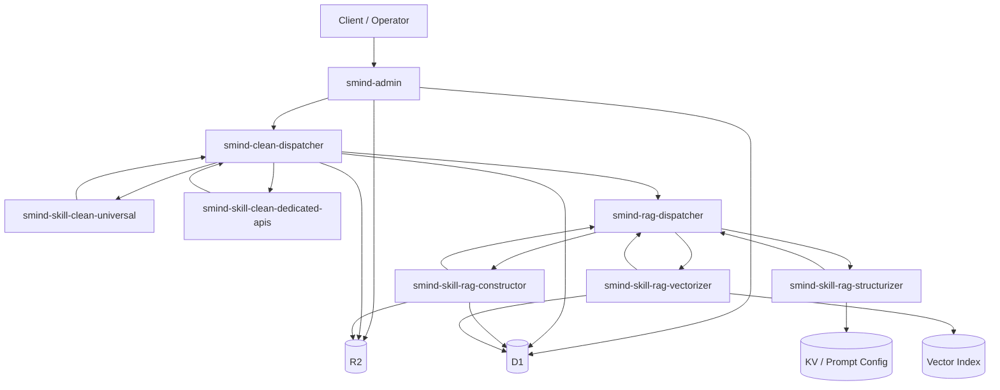

# smind-family 结构分析（面向“迁移为本地 Python 单体应用”）

## 0. 结论先行

**Verdict：可以迁移为本地 Python 单体应用，且从架构边界上看是可收敛的；但这不是“简单搬运”，而是一次明确的“分布式 Worker 流水线内联化”改造。**

当前仓库本质上不是单体，而是一个基于 Cloudflare Workers / Queues / D1 / R2 / AI / Vectorize / Durable Object 的多服务事件驱动流水线。它已经天然分成：

1. **控制平面**：`smind-admin`
2. **两层编排器**：`smind-clean-dispatcher`、`smind-rag-dispatcher`
3. **技能执行器**：clean 系列与 rag 系列 skill workers

如果要改造成**本地 Python 单体**，可行的总体方向不是继续保留“服务间 RPC + 队列回调”形态，而是：

1. 把 **queue / callback / service binding** 内联成单进程任务状态机；
2. 把 **Cloudflare 平台能力** 替换为本地适配器；
3. 保留现有 message contract / workflow state / action registry 作为 Python 内部模块边界。

迁移难点主要集中在：

1. **异步流水线重放与 restart 语义**；
2. **Vectorize + Durable Object** 的替换；
3. **Browser Rendering / Workers AI / R2 / D1 / KV** 的本地等价实现；
4. **scatter / callback / child file** 这种多分支产物流转。

---

## 1. 顶层 todo-list（每个文件夹一个锚点）

> 用作后续深挖索引；本轮分析已完成首轮结构级盘点。

| Todo ID | 文件夹 | 当前业务类型 | 当前架构角色 | 状态 |
| --- | --- | --- | --- | --- |
| `analyze-docs` | `docs/` | 文档占位/评估输出 | 非运行时目录 | done |
| `analyze-smind-admin` | `smind-admin/` | 控制平面/API 网关 | 系统入口、鉴权、工作流发起 | done |
| `analyze-smind-clean-dispatcher` | `smind-clean-dispatcher/` | 清洗编排器 | clean 流水线状态机 | done |
| `analyze-smind-rag-dispatcher` | `smind-rag-dispatcher/` | RAG 编排器 | rag 流水线状态机 | done |
| `analyze-smind-skill-clean-dedicated-apis` | `smind-skill-clean-dedicated-apis/` | 专用 API 清洗 worker | 针对特定 API/provider 的清洗执行器 | done |
| `analyze-smind-skill-clean-universal` | `smind-skill-clean-universal/` | 通用清洗 worker | 通用网页/文档清洗执行器 | done |
| `analyze-smind-skill-rag-constructor` | `smind-skill-rag-constructor/` | RAG 构造 worker | chunk / summary / layer-json 构造 | done |
| `analyze-smind-skill-rag-structurizer` | `smind-skill-rag-structurizer/` | RAG 结构化 worker | 结构抽取/归一化 | done |
| `analyze-smind-skill-rag-vectorizer` | `smind-skill-rag-vectorizer/` | 向量化 worker | embedding / index / purge / restart 执行器 | done |

---

## 2. 总体架构快照

### 2.1 架构类型

这是一个**控制平面 + 多级异步编排 + 技能 worker** 的流水线系统，而不是普通 CRUD Web 应用。

### 2.2 运行时核心依赖

| 能力 | 当前载体 | 在架构中的作用 |
| --- | --- | --- |
| HTTP / RPC | Cloudflare Workers `fetch` | 对外入口、服务间轻 RPC |
| 异步编排 | Cloudflare Queues | intake、callback、step dispatch |
| 关系/状态存储 | D1 | 工作流、文件、静态资源、状态与记录 |
| 对象存储 | R2 | 原始文件、清洗产物、结构化产物 |
| 提示词配置 | KV | prompt / config 分发 |
| 模型能力 | Workers AI / 外部 LLM | 清洗、理解、结构化、embedding |
| 向量检索 | Vectorize | 最终向量索引 |
| 串行状态执行 | Durable Object | vectorizer 的流程控制与本地状态机 |

### 2.3 代码规模（近似）

> 这里按仓库内 `.ts/.js` 文件粗略统计，用于衡量“核心代码规模”。

| 文件夹 | 代码文件数（近似） | 代码行数（近似） |
| --- | ---: | ---: |
| `smind-admin/` | 36 | 5585 |
| `smind-clean-dispatcher/` | 20 | 4554 |
| `smind-rag-dispatcher/` | 20 | 4564 |
| `smind-skill-clean-dedicated-apis/` | 21 | 3731 |
| `smind-skill-clean-universal/` | 15 | 3424 |
| `smind-skill-rag-constructor/` | 15 | 3887 |
| `smind-skill-rag-structurizer/` | 15 | 2897 |
| `smind-skill-rag-vectorizer/` | 15 | 3095 |

**运行时代码总量约 31.7k 行。** 这说明它更像一个“拆散的产品内核”，不是轻量 demo。

---

## 3. 分文件夹分析 blocks

## 3.1 `docs/`

### 业务类型

文档/评估输出目录，当前不是业务运行时组件。

### 在整体架构中的角色

不参与线上请求、异步流水线或数据处理；更像是后续分析、设计和迁移资料的承载位置。

### 核心代码规模

几乎无运行时代码；当前主要价值是承接本报告这类结构化分析输出。

### RPC 接口

**无。**

### 内部通信 / 数据流方向

**无运行时数据流。**

### 迁移观察

该目录应继续保留，用来承接：

1. 现状索引；
2. 单体迁移设计稿；
3. 数据模型与流程映射文档。

---

## 3.2 `smind-admin/`

### 业务类型

控制平面、对外 API 网关、工作流发起器。

### 在整体架构中的角色

这是整套系统的**北向入口**。用户、团队、鉴权、上传、URL/API 接入、工作流查询等都从这里进入。它负责把“外部输入”标准化为内部 workflow / file / static resource 记录，然后把任务送入 clean 或 rag 流水线。

### 核心代码规模

- 代码体量约 **5585 行**
- 是当前仓库中最大的业务入口之一
- 包含鉴权、团队、管理、ingestion、workflow、DB 访问多个子域

### 已识别 RPC 接口

对外统一入口为 `POST /rpc`（以及直连 POST 分发），按源码分支已识别的 RPC 名称包括：

| 精确 RPC 名称 | 作用 |
| --- | --- |
| `services/auth/login` | 登录 |
| `services/auth/register` | 注册 |
| `services/auth/validate_api_key` | 校验 API key / 认证凭据 |
| `services/user/profile` | 获取用户资料 |
| `services/user/update` | 更新用户资料 |
| `services/user/reset_password` | 重置密码 |
| `services/team/create` | 创建团队 |
| `services/team/info` | 获取团队信息 |
| `services/team/create_api_key` | 创建团队 API key |
| `services/workflow/list` | 列出 workflow |
| `services/workflow/update` | 更新 workflow |
| `ingestion/files/initiate` | 初始化文件上传 |
| `ingestion/files/confirm` | 确认文件上传并触发流程 |
| `ingestion/urls/submit` | 提交 URL ingestion |
| `ingestion/apis/submit` | 提交 API ingestion |
| `management/files/list` | 列出文件 |
| `management/files/detail` | 查看文件详情 |
| `management/static_files/list` | 列出静态资源 |
| `management/static_files/detail` | 查看静态资源详情 |
| `management/static_files/delete` | 删除静态资源 |

从子模块上看，还可进一步归并为：

1. **认证域**：注册、登录、验证；
2. **团队域**：创建、信息、API key；
3. **用户域**：profile、update、reset password；
4. **ingestion 域**：file / url / api 三类入口；
5. **workflow 域**：list / update；
6. **management 域**：文件与静态资源管理。

### 内部通信 / 数据流方向

主数据流为：

```text
Client
  -> smind-admin /rpc
  -> D1: 建立 user/team/file/workflow/static_resource 记录
  -> R2: 文件上传/静态资源持久化
  -> Queue: 投递 clean-dispatcher-intake 或后续 rag 流程起点
```

更细分地看：

1. **file ingestion**
   - 先创建上传意图；
   - 文件落到对象存储；
   - `confirm_file_upload` 后写 D1；
   - 生成 workflow / static file / source 记录；
   - 投递到 clean dispatcher。
2. **URL ingestion**
   - 生成 URL 类型静态资源；
   - 直接触发 clean 流程。
3. **API ingestion**
   - 生成 provider/API 类型资源；
   - 交给 dedicated API cleaner。

### 对整体拓扑的作用

`smind-admin` 把“外部世界的输入”压缩成统一内部对象，是**控制面与数据入口的合流点**。

### 本地单体迁移观察

这是最适合最先迁移的目录。迁到 Python 单体时，它可直接成为：

1. `FastAPI`/`Flask` 的北向 API 层；
2. 用户/团队/鉴权模块；
3. ingestion 编排入口；
4. 单体内 workflow 启动器。

需要替换的主要是：

1. D1 -> SQLite/PostgreSQL；
2. R2 -> 本地文件系统或 S3 兼容对象存储；
3. queue 发送 -> 单体内部 job/state-machine 调用。

---

## 3.3 `smind-clean-dispatcher/`

### 业务类型

清洗流水线编排器。

### 在整体架构中的角色

这是 clean 阶段的**中心状态机**。它本身不做重清洗，而是：

1. 接 intake；
2. 读取当前 workflow step；
3. 决定发往哪个 clean skill worker；
4. 接 callback；
5. 合并结果、推进下一步、必要时启动 rag。

### 核心代码规模

- 代码体量约 **4554 行**
- 关键逻辑集中在 `flows/*`、`services/*`、`core/*`
- 是强状态编排器，而非纯转发器

### 已识别 RPC 接口

对外 fetch/RPC 面非常小，主要是：

| 接口 | 作用 |
| --- | --- |
| `clean/restart` | 重新启动/重放 clean 工作流或 step |

更重要的是它的**消息接口**：

| 消息来源 | 消息类型 | 含义 |
| --- | --- | --- |
| admin / 其他上游 | `WORKFLOW_START` | 启动 clean workflow |
| clean skill callback | `STEP_CALLBACK` | 上报 step 完成/失败/产物 |

### 内部通信 / 数据流方向

主流向为：

```text
smind-admin
  -> clean-dispatcher-intake
  -> smind-clean-dispatcher
  -> 路由到 universal / dedicated clean queues
  -> clean skills 执行
  -> callback 回到 smind-clean-dispatcher
  -> finalizer 合并产物
  -> 触发 rag-dispatcher-intake
```

内部模块职责可概括为：

1. `processor`
   - intake/callback 总调度；
2. `orchestrator`
   - 根据 step/action 选择目标 worker；
3. `mapper`
   - 规范化 step/action 与消息格式；
4. `finalizer`
   - 写状态、处理 child files、决定是否进入 rag；
5. `restarter`
   - 重启/回放 workflow；
6. `validator`
   - 输入与 step 状态保护。

### 对整体拓扑的作用

它是 **“ingestion world” 与 “structured content world”** 之间的中枢。clean dispatcher 把不同源（file/url/api）统一变成可继续进入 rag 的清洗产物。

### 本地单体迁移观察

迁到 Python 单体后，这一层**不该再保持独立服务**，但**必须保留其状态机语义**。最合理的落点是：

1. 保留 `clean_workflow_engine`；
2. 保留 step registry / action routing；
3. 把 queue callback 改成函数返回值或 job completion event；
4. 把 restart 语义保留成单体内部管理接口。

它是迁移中的**核心保留对象**。

---

## 3.4 `smind-rag-dispatcher/`

### 业务类型

RAG 流水线编排器。

### 在整体架构中的角色

这是 rag 阶段的**中心状态机**，负责把 clean 产物推进到：

1. structurizer
2. constructor
3. vectorizer

并管理 restart / purge / callback 合并。

### 核心代码规模

- 代码体量约 **4564 行**
- 与 clean dispatcher 规模接近
- 关键复杂度来自多阶段 rag step、purge、vectorizer 对接

### 已识别 RPC 接口

| 接口 | 作用 |
| --- | --- |
| `rag/restart` | 重启或重放 rag workflow / step |
| `rag/purge` | 清理 rag/vector 相关产物与索引 |

关键消息接口：

| 消息来源 | 消息类型 | 含义 |
| --- | --- | --- |
| clean dispatcher / 上游 | `WORKFLOW_START` | 启动 rag workflow |
| rag skill callback | `STEP_CALLBACK` | 上报结构化、构造、向量化结果 |

### 内部通信 / 数据流方向

主流向为：

```text
clean-dispatcher finalizer
  -> rag-dispatcher-intake
  -> smind-rag-dispatcher
  -> skill-rag-structurizer-intake
  -> callback
  -> skill-rag-constructor-intake
  -> callback
  -> Vectorizer Durable Object / start_step
  -> callback
  -> rag finalizer
```

内部关键职责：

1. `processor`
   - 处理 intake 与 callback；
2. `orchestrator`
   - 选择下一 rag step；
3. `mapper`
   - step 与消息协议映射；
4. `finalizer`
   - 收敛 rag 各阶段产物；
5. `purger`
   - 删除/清理向量或相关状态；
6. `restarter`
   - 支持局部或整体重启。

### 对整体拓扑的作用

它把“清洗后的内容”转换成“可用于检索/问答的结构化知识对象”。如果说 clean dispatcher 解决的是“把源变成规范文本/片段”，那么 rag dispatcher 解决的是“把规范文本变成知识索引”。

### 本地单体迁移观察

与 clean dispatcher 一样，这个目录不应在 Python 化后继续独立部署，但其**编排器语义必须完整保留**。尤其要保留：

1. step 顺序；
2. callback 合并机制；
3. restart/purge 管理能力；
4. vectorizer 前后的状态更新。

本目录是单体化时第二个必须“原样抽象、重新落地”的核心状态机。

---

## 3.5 `smind-skill-clean-dedicated-apis/`

### 业务类型

面向特定 provider / domain 的专用 API 清洗 worker。

### 在整体架构中的角色

它是 clean 体系里的**专用执行器**，处理“不能靠通用网页/文档清洗解决”的 API 型源。其定位是：

1. 调用特定外部 API 或 provider；
2. 解析 provider 自有结构；
3. 输出标准化 clean callback payload。

### 核心代码规模

- 代码体量约 **3731 行**
- 规模中等，但业务分支通常更依赖 provider-specific 逻辑
- 关键点在 `action_registry` 与 provider handler

### 已识别 RPC 接口

对外业务 RPC 很少，主要是发现能力：

| 接口 | 作用 |
| --- | --- |
| `list_actions` | 返回当前 worker 支持的 action 列表 |

更本质的是其队列入口：

| 入口 | 作用 |
| --- | --- |
| `skill-clean-dedicated-apis-intake` | 接收 clean dispatcher 下发的 step |

从 action registry 可见，其执行面聚焦“专有 API 动作”，例如税务/机构/API 列表抓取等 provider 动作族。

### 内部通信 / 数据流方向

```text
smind-clean-dispatcher
  -> skill-clean-dedicated-apis-intake
  -> provider-specific fetch / parse / normalize
  -> 生成 result / child files / normalized payload
  -> callback 到 clean-dispatcher
```

它常见的输出不只是“一个文本结果”，还可能包括：

1. 清洗后的正文；
2. 元数据；
3. `child_files` / `static_resources`；
4. scatter 结果。

### 对整体拓扑的作用

它承接 API 型源，是 clean 阶段的**非通用分支**。没有它，系统只能处理 file/url，无法稳定支持需要 provider adapter 的接入。

### 本地单体迁移观察

该目录最适合迁移为 Python 单体中的：

1. `providers/` 或 `connectors/` 子模块；
2. 每个 provider 一个 adapter；
3. 由 clean workflow engine 直接调度。

即：**保留 action registry 思想，取消独立 worker 进程。**

---

## 3.6 `smind-skill-clean-universal/`

### 业务类型

通用网页/文档清洗 worker。

### 在整体架构中的角色

这是 clean 体系里的**通用执行器**，处理：

1. HTML 抓取；
2. 浏览器获取；
3. PDF/网页文本抽取；
4. 基于模型的清洗和理解。

它覆盖了最“普适”的源处理能力。

### 核心代码规模

- 代码体量约 **3424 行**
- 关键价值不在框架代码，而在 action 注册与执行策略

### 已识别 RPC 接口

| 接口 | 作用 |
| --- | --- |
| `list_actions` | 返回通用 cleaner 支持的 action 集 |

队列入口：

| 入口 | 作用 |
| --- | --- |
| `skill-clean-universal-intake` | 接收 clean dispatcher 下发的通用 clean step |

从 action registry 与处理流看，当前能力族包括：

1. `htmlCrawl`
2. `htmlCrawl-geminiClean`
3. `browserFetch`
4. `browserFetch-geminiClean`
5. `browserPDF`
6. `geminiUnderstanding`

### 内部通信 / 数据流方向

```text
smind-clean-dispatcher
  -> skill-clean-universal-intake
  -> 抓取 / 浏览器渲染 / 文本抽取 / LLM 清洗
  -> 生成标准化 clean result
  -> callback 到 clean-dispatcher
```

依赖面通常包括：

1. 外部网页抓取；
2. 浏览器渲染服务；
3. 模型清洗/理解；
4. 对象存储与状态记录。

### 对整体拓扑的作用

它是 clean 阶段的**主力执行器**。从目录职责上看，file/url 类型的大多数内容都经由它完成第一轮标准化。

### 本地单体迁移观察

迁移到 Python 单体后，应将其拆成：

1. `cleaners/web.py`
2. `cleaners/pdf.py`
3. `cleaners/llm_clean.py`
4. `cleaners/browser.py`

真正难替换的不是队列，而是：

1. 浏览器渲染能力；
2. LLM 调用链；
3. 不同 action 的超时与重试行为。

---

## 3.7 `smind-skill-rag-constructor/`

### 业务类型

RAG 构造 worker。

### 在整体架构中的角色

它负责把清洗/结构化后的内容，进一步构造成适合向量化与知识检索使用的中间对象，例如：

1. chunk；
2. summary；
3. layer json；
4. 向量前置记录。

### 核心代码规模

- 代码体量约 **3887 行**
- 关键逻辑在 `flows/constructor.ts` 与 `services/recorder.ts`

### 已识别 RPC 接口

对外业务 RPC 基本没有，fetch 更像 health/service entry。

真正入口是：

| 入口 | 作用 |
| --- | --- |
| `skill-rag-constructor-intake` | 接收 rag dispatcher 下发的 constructor step |

### 内部通信 / 数据流方向

```text
smind-rag-dispatcher
  -> skill-rag-constructor-intake
  -> 构建 chunk / summary / layer-json
  -> 写 D1 / R2 中间记录
  -> 回调 rag-dispatcher
```

该 worker 的特征是：它不仅“算结果”，还承担**中间构造成果落库**，因此在数据链条中非常关键。

### 对整体拓扑的作用

它位于 rag 阶段中后部，是**结构化内容 -> 向量化输入对象** 的桥梁。

### 本地单体迁移观察

在 Python 单体中，这个目录应直接变成：

1. `rag/constructor.py`
2. `rag/chunker.py`
3. `rag/recorders.py`

不需要保留独立服务，但必须保留：

1. chunk 生成规则；
2. summary / layer-json 结构；
3. 向量化前的记录模型。

---

## 3.8 `smind-skill-rag-structurizer/`

### 业务类型

RAG 结构化抽取 worker。

### 在整体架构中的角色

它负责把清洗后的文本进一步提取为结构化字段/结构化语义对象，为 constructor 和后续知识索引准备更规整的输入。

### 核心代码规模

- 代码体量约 **2897 行**
- 是当前几个 skill 中相对更轻的一层，但业务意义很强

### 已识别 RPC 接口

对外业务 RPC 基本没有，核心入口为：

| 入口 | 作用 |
| --- | --- |
| `skill-rag-structurizer-intake` | 接收 rag dispatcher 下发的 structurizer step |

### 内部通信 / 数据流方向

```text
smind-rag-dispatcher
  -> skill-rag-structurizer-intake
  -> 结构化抽取 / reasoning / retry strategy
  -> 输出 structured payload
  -> callback 到 rag-dispatcher
```

它通常承担的是“把大段内容变成字段化/槽位化信息”的工作，因此 callback payload 往往不是最终索引，而是**下一阶段构造的输入增强层**。

### 对整体拓扑的作用

它是 rag 中的**语义整形层**。没有它，constructor 只能处理更原始的文本，而知识密度和检索质量会下降。

### 本地单体迁移观察

迁移时可直接变成 Python 的一个内部处理步骤；重点是保留：

1. 提示词与策略配置；
2. retry / fallback 策略；
3. 输出 schema。

---

## 3.9 `smind-skill-rag-vectorizer/`

### 业务类型

向量化与索引 worker。

### 在整体架构中的角色

这是当前全仓**Cloudflare 平台耦合度最高**的模块。它负责：

1. embedding 生成；
2. 向量写入；
3. 向量状态维护；
4. purge / restart；
5. Durable Object 内部串行控制。

### 核心代码规模

- 代码体量约 **3095 行**
- 关键复杂度集中在 `vectorizer_do.ts`、`vectorizer/engine.ts`、`core/db.ts`

### 已识别 RPC 接口

对外业务 fetch 面很小，常见是 health。

真正的执行入口是：

| 入口 | 作用 |
| --- | --- |
| Durable Object `/start_step` | 启动向量化 step、重启或 purge |

同时它还会把结果通过 callback 回流到 rag dispatcher。

### 内部通信 / 数据流方向

```text
smind-rag-dispatcher
  -> Durable Object /start_step
  -> vectorizer engine
  -> Workers AI / embedding
  -> Vectorize index upsert/delete
  -> D1 状态更新
  -> callback 到 rag-dispatcher
```

该模块同时处理：

1. 向量写入；
2. 向量删除/清理；
3. 流程串行性；
4. restart / purge 的执行细节。

### 对整体拓扑的作用

它是 rag 流水线的终点，也是“内容系统”进入“检索系统”的最后一道门。

### 本地单体迁移观察

这是迁移风险最高的目录。迁成 Python 单体时，建议不要机械照搬 DO 语义，而应重写成：

1. 本地向量服务适配层；
2. 单体内部串行任务执行器；
3. 幂等化的 vector state manager。

替代方案通常为：

| 现能力 | Python 单体替代方向 |
| --- | --- |
| Durable Object | 进程内任务锁 / DB 行锁 / 单线程 worker |
| Vectorize | pgvector / Qdrant / Milvus / Chroma |
| Workers AI Embedding | OpenAI / Gemini / 本地 embedding 模型 |

---

## 4. 完整拓扑分析

## 4.1 逻辑拓扑



## 4.2 数据流方向

### 主干流

```text
外部输入
  -> admin 建档/鉴权/上传确认
  -> clean dispatcher 编排
  -> clean skill 执行并 callback
  -> clean finalizer 形成规范化产物
  -> rag dispatcher 编排
  -> structurizer / constructor / vectorizer
  -> 最终形成可检索知识对象与向量索引
```

### 关键反向流

所有 skill worker 都不是最终状态持有者，**真正的 workflow owner 在 dispatcher**。因此系统中最关键的反向流是：

```text
skill result
  -> callback
  -> dispatcher 更新 workflow state
  -> dispatcher 决定下一步
```

这意味着当前系统虽然“执行器很多”，但状态中心其实只有两层：

1. clean dispatcher
2. rag dispatcher

### 关键共享资源

1. **D1**：状态与业务主记录；
2. **R2**：原文件/中间产物/层级 json；
3. **KV**：prompt/config；
4. **Vector index**：最终检索索引；
5. **LLM/embedding provider**：内容理解与向量生成。

---

## 5. RPC / 消息接口总览

| 组件 | 对外 RPC | 队列/消息入口 | 回流方向 |
| --- | --- | --- | --- |
| `smind-admin` | `auth/*`, `team/*`, `user/profile`, `ingestion/*`, `management/*` | 无核心消费；主要负责发起 | 发往 clean / rag 起点 |
| `smind-clean-dispatcher` | `clean/restart` | `WORKFLOW_START`, `STEP_CALLBACK` | 向 clean skill 下发；完成后发往 rag |
| `smind-rag-dispatcher` | `rag/restart`, `rag/purge` | `WORKFLOW_START`, `STEP_CALLBACK` | 向 rag skill 下发；最终收敛 |
| `skill-clean-dedicated-apis` | `list_actions` | dedicated clean intake | callback 到 clean dispatcher |
| `skill-clean-universal` | `list_actions` | universal clean intake | callback 到 clean dispatcher |
| `skill-rag-constructor` | health 型入口 | constructor intake | callback 到 rag dispatcher |
| `skill-rag-structurizer` | health 型入口 | structurizer intake | callback 到 rag dispatcher |
| `skill-rag-vectorizer` | health 型入口 | DO `/start_step` | callback 到 rag dispatcher |

---

## 6. 迁移为本地 Python 单体的判断

## 6.1 可迁移性判断

**可迁移，且总体可行性高。**

原因有三个：

1. 当前系统已经有清晰的模块边界；
2. 当前系统的服务多数是“无状态执行器 + 状态集中编排器”；
3. 各服务间依赖主要是消息协议与共享存储，不是深度二进制耦合。

换言之，它不是“必须分布式才能跑”的系统，而是“先以 Cloudflare 分布式形态实现出来”的系统。

## 6.2 不建议原样保留的部分

以下东西在 Python 单体里应该**被消解**，而不是原样复制：

1. 每个 worker 一个独立服务；
2. queue 作为唯一控制流；
3. service binding 形式的内部 RPC；
4. vectorizer 的 Durable Object 形态。

## 6.3 建议保留的抽象

以下抽象建议保留：

1. `workflow` / `step` 状态模型；
2. `action registry`；
3. `callback payload schema`；
4. restart / purge / finalizer 语义；
5. provider adapter 与通用 cleaner 的分层。

## 6.4 推荐的 Python 单体落地形态

建议收敛为如下模块：

| Python 单体模块 | 对应当前目录 |
| --- | --- |
| `app/api` | `smind-admin` |
| `app/workflows/clean` | `smind-clean-dispatcher` |
| `app/workflows/rag` | `smind-rag-dispatcher` |
| `app/providers` | `smind-skill-clean-dedicated-apis` |
| `app/cleaners` | `smind-skill-clean-universal` |
| `app/rag/structurizer` | `smind-skill-rag-structurizer` |
| `app/rag/constructor` | `smind-skill-rag-constructor` |
| `app/rag/vectorizer` | `smind-skill-rag-vectorizer` |
| `app/storage` | D1 / R2 / KV 替代层 |
| `app/jobs` | queue / callback / retry / restart 内联层 |

## 6.5 迁移风险排序

| 风险级别 | 目录/能力 | 原因 |
| --- | --- | --- |
| 最高 | `smind-skill-rag-vectorizer` | DO + Vectorize + embedding 串行控制最平台化 |
| 高 | `smind-skill-clean-universal` | 浏览器渲染、模型清洗、抓取稳定性 |
| 高 | `smind-clean-dispatcher` / `smind-rag-dispatcher` | restart/callback/finalizer 的状态机语义不可丢 |
| 中 | `smind-skill-clean-dedicated-apis` | provider 适配复杂，但边界清晰 |
| 中 | `smind-admin` | 入口复杂但最适合单体化 |
| 低 | `docs` | 非运行时代码 |

---

## 7. 建议的后续深挖顺序

为了支撑后续真正迁移，建议按以下顺序展开更深分析：

1. **`smind-clean-dispatcher/`**
   - 先把 clean workflow state machine 完全抽出来；
2. **`smind-rag-dispatcher/`**
   - 再抽 rag workflow state machine；
3. **`smind-skill-rag-vectorizer/`**
   - 提前识别本地向量方案与 purge/restart 语义；
4. **`smind-skill-clean-universal/`**
   - 识别所有抓取/浏览器/LLM action 的替换策略；
5. **`smind-admin/`**
   - 最后把入口、鉴权、管理面收敛进单体 API。

---

## 8. 最终判断

**这个仓库可以被收敛成本地 Python 单体，而且从现有边界看，重构路径是清晰的。**

但它的本质不是“把几个 HTTP 接口改写成 Python”这么简单，而是：

1. 把 **Cloudflare 分布式事件系统** 改写成 **本地单体任务状态机**；
2. 把 **平台绑定能力** 改写成 **可替换的本地适配层**；
3. 把 **多 worker 拓扑** 收敛成 **单进程模块拓扑**。

**因此迁移策略应是“保留编排抽象，去掉部署拓扑”。**
