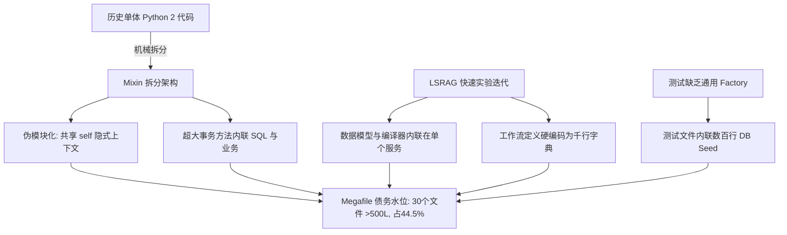
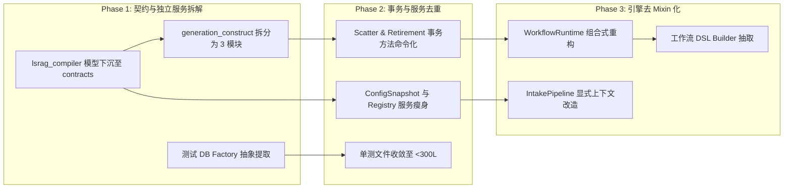

# MKB NS2 阶段后 Megafile 债务水位与架构分析报告

> **对象**：`after NS2（MKB New Start Phase 2 交付后）`  
> **日期**：`2026-08-15`  
> **作者**：`Gemini (Antigravity AI)`（panel：`Architecture & Code Health`）  
> **文档性质**：`eval / state-analysis`（本文是现状快照 + 前瞻交接；不是 closure / verdict / charter）  
> **文档状态**：`draft`  
> **对照基线**：`NS2 阶段活跃代码库（src/, api/, intake/, tests/；已明确排除 context/ 封存基线）`  
> **上游权威输入**：  
> - `myknowledgebase 活跃代码库 AST 解析、LOC 统计与分支复杂度度量`  
> - `myknowledgebase/.adocs/eval-state-analysis.md 评估模板规范`  
> **下游消费者**：`NS3 架构演进规划 / MKB 核心维护者决策`  

---

## 0. 水位 / 健康一句话（TL;DR）

- **一句话现状**：**业务逻辑闭环完整，但活跃代码中存在显著的“伪拆分 Mixin 上帝类”与“千行级 Megafile”结构性债务，Top 30 文件占据了全库 44.5% 的活跃代码量。**
- **核心结论**：
  1. **资产与范围定界**：`context/` 下的 207 个遗留文件（31,062 行）属于历史封存资产，不计入当前维护债务；活跃代码库包含 **236 个 Python 文件，共 48,014 行代码**。
  2. **债务水位**：活跃代码中共有 **30 个文件超过 500 行**（合计 21,353 行），其中 **3 个文件突破 1,000 行**（[generation_construct.py](file:///root/workspace/myknowledgebase/src/runtime/intake/generation_construct.py) 1,366L、[lsrag_compiler.py](file:///root/workspace/myknowledgebase/src/services/lsrag_compiler.py) 1,161L、[lsrag_definition.py](file:///root/workspace/myknowledgebase/src/workflows/lsrag_definition.py) 1,081L）。
  3. **核心债务形态**：代码库在从历史单体迁移时采用了“按文件拆分 Mixin”的过渡策略，导致虽然单一文件行数被切分，但形成了隐式共享状态的 **超大上帝类**（如 [IntakePipeline](file:///root/workspace/myknowledgebase/src/runtime/intake/pipeline.py) 达 8,786L，[WorkflowRuntime](file:///root/workspace/myknowledgebase/src/runtime/workflow/runtime.py) 达 4,800L），并伴随有 35+ 个超过 100 行的超长原子事务函数。

---

## 1. 方法与对照基线

- **分析范围与定界**：
  - **活跃代码（纳入债务审计）**：`src/`、`api/`、`intake/`、`tests/`、`scripts/`。
  - **封存基线（排除债务统计）**：`context/legacy-python/` 与 `context/legacy-python-2/`。上述目录已封存，仅用于历史设计参考与语义对齐。
- **度量指标**：
  - 物理总行数（Total LOC）、纯代码行数（SLOC，去除空行与纯注释）。
  - AST 语法树结构：类数量、顶层函数数、类内方法数、依赖 Import 数量。
  - 分支复杂度代理（Branch Nodes）：统计 `if`、`for`、`while`、`try/except`、`match`、`and/or` 节点总数与分支密度。
- **可采信证据来源**：
  - 仓库内 Python 静态 AST 解析扫描结果（见附录 A）。

---

## 2. 回看清单（交付快照与文件台账）

### 2.1 活跃代码库规模与分布台账

```
+-------------------------------------------------------------------------------+
|  活跃代码库总览 (Active Codebase): 236 files | 48,014 Total LOC | 42,289 SLOC |
+-------------------------------------------------------------------------------+
|  > 1000 lines      :   3 files ( 1.3%) |  3,608 lines ( 7.5%)                 |
|  800 - 1000 lines  :   5 files ( 2.1%) |  4,367 lines ( 9.1%)                 |
|  500 - 800 lines   :  22 files ( 9.3%) | 13,378 lines (27.9%)                 |
|  300 - 500 lines   :  39 files (16.5%) | 16,469 lines (34.3%)                 |
|  100 - 300 lines   :  70 files (29.7%) | 12,608 lines (26.3%)                 |
|  < 100 lines       :  97 files (41.1%) |  3,514 lines ( 7.3%)                 |
+-------------------------------------------------------------------------------+
```

### 2.2 活跃代码 Top 30 Megafile（> 500 LOC）明细表

| 排名 | 目标文件路径 | 总行数 | 纯代码 | 分支节点 (密度) | 类/方法/函数 | 核心职责与债务特征 |
| :---: | :--- | :---: | :---: | :---: | :---: | :--- |
| 1 | [src/runtime/intake/generation_construct.py](file:///root/workspace/myknowledgebase/src/runtime/intake/generation_construct.py) | **1,366** | 1,309 | 129 (0.094) | 1 类 / 26 方法 | 单一 Mixin 承载 Markdown 提取、LLM 构造、Schema 合约重建；含 3 个超 200 行函数 |
| 2 | [src/services/lsrag_compiler.py](file:///root/workspace/myknowledgebase/src/services/lsrag_compiler.py) | **1,161** | 1,050 | **169 (0.146)** | 13 类 / 30 方法 | 混合了 12 个数据模型与 625 行编译器实现，包含深层多层 JSON 适配与多阶段校验 |
| 3 | [src/workflows/lsrag_definition.py](file:///root/workspace/myknowledgebase/src/workflows/lsrag_definition.py) | **1,081** | 995 | 20 (0.019) | 0 类 / 9 函数 | 硬编码 DSL 工作流图定义；内嵌数十个深层嵌套字典、JSON Schema 和 Prompt 模板 |
| 4 | [src/runtime/workflow/runtime_core.py](file:///root/workspace/myknowledgebase/src/runtime/workflow/runtime_core.py) | **932** | 845 | 98 (0.105) | 1 类 / 18 方法 | `WorkflowCoreMixin` (888L)；包含 `claim_next` (155L) 等大型复杂数据库调度事务 |
| 5 | [src/services/config_snapshots.py](file:///root/workspace/myknowledgebase/src/services/config_snapshots.py) | **896** | 797 | 128 (0.143) | 2 类 / 26 方法 | `ConfigSnapshotService` (781L)；包含配置深层合并、Prompt 提取与哈希校验 (`prepare` 153L) |
| 6 | [src/runtime/intake/clean_preflight.py](file:///root/workspace/myknowledgebase/src/runtime/intake/clean_preflight.py) | **879** | 844 | 134 (0.152) | 1 类 / 19 方法 | `IntakeCleanPreflightMixin` (855L)；密集的状态清洗、封箱校验与 Registered API 检查 |
| 7 | [src/services/registry.py](file:///root/workspace/myknowledgebase/src/services/registry.py) | **857** | 782 | 98 (0.114) | 3 类 / 20 方法 | `RegistryService` (615L)；集成了 Schema 引导、域注册、Prompt 目录等全生命周期 |
| 8 | [tests/unit/test_workflow_runtime.py](file:///root/workspace/myknowledgebase/tests/unit/test_workflow_runtime.py) | **803** | 725 | 44 (0.055) | 6 类 / 23 方法 | 单元测试文件过大；内联了庞大的测试数据库 Seed (`_seed_runtime` 137L) |
| 9 | [src/runtime/intake/generation_artifacts.py](file:///root/workspace/myknowledgebase/src/runtime/intake/generation_artifacts.py) | **776** | 707 | 58 (0.075) | 1 类 / 26 方法 | `IntakeGenerationArtifactsMixin` (740L)；工件写入、指针推进与结构重构高度耦合 |
| 10 | [src/runtime/workflow/runtime_outcome.py](file:///root/workspace/myknowledgebase/src/runtime/workflow/runtime_outcome.py) | **767** | 714 | 57 (0.074) | 1 类 / 11 方法 | `WorkflowOutcomeMixin` (741L)；包含 `accept_outcome` (189L) 及租约恢复事务 |
| 11 | [src/services/scatter_intake.py](file:///root/workspace/myknowledgebase/src/services/scatter_intake.py) | **736** | 690 | 26 (0.035) | 4 类 / 9 方法 | `ScatterAcceptanceWriter` (640L)；其 `commit` 写入事务单体达 260 行 |
| 12 | [src/runtime/workflow/runtime_scatter.py](file:///root/workspace/myknowledgebase/src/runtime/workflow/runtime_scatter.py) | **691** | 644 | 67 (0.097) | 1 类 / 9 方法 | `WorkflowScatterMixin` (671L)；Scatter 汇聚与人工审核事务 (`_maybe_converge` 208L) |
| 13 | [src/runtime/task/task_projections.py](file:///root/workspace/myknowledgebase/src/runtime/task/task_projections.py) | **680** | 645 | 88 (0.129) | 1 类 / 9 方法 | `TaskProjectionsMixin` (664L)；任务血缘与 Gate 状态投影 (`lineage` 147L) |
| 14 | [src/services/index_retirement.py](file:///root/workspace/myknowledgebase/src/services/index_retirement.py) | **672** | 605 | 50 (0.074) | 6 类 / 22 方法 | `IndexGenerationRetirementService` (565L)；软删除与调度清理事务内联 |
| 15 | [src/workflows/builtin_scatter.py](file:///root/workspace/myknowledgebase/src/workflows/builtin_scatter.py) | **655** | 623 | 7 (0.011) | 0 类 / 5 函数 | 硬编码内置 Scatter 子工作流状态机字典定义 |
| 16 | [src/runtime/workflow/runtime_materialize.py](file:///root/workspace/myknowledgebase/src/runtime/workflow/runtime_materialize.py) | **654** | 596 | 70 (0.107) | 1 类 / 9 方法 | `WorkflowMaterializeMixin` (626L)；路由计算与进程物化事务 (`_enter_control_tx` 165L) |
| 17 | [tests/unit/test_retrieval_service.py](file:///root/workspace/myknowledgebase/tests/unit/test_retrieval_service.py) | **624** | 523 | 19 (0.030) | 11 类 / 33 方法 | 检索服务单测；内联多表 SQL 与向量表打桩 |
| 18 | [tests/unit/test_compression_channel.py](file:///root/workspace/myknowledgebase/tests/unit/test_compression_channel.py) | **585** | 521 | 24 (0.041) | 0 类 / 23 函数 | 压缩通道单测；包含大量重复的样本构建逻辑 |
| 19 | [src/runtime/intake/acquisition_ingest.py](file:///root/workspace/myknowledgebase/src/runtime/intake/acquisition_ingest.py) | **581** | 537 | 65 (0.112) | 1 类 / 9 方法 | `IntakeAcquisitionIngestMixin` (554L)；多源获取与内容抓取入库 |
| 20 | [src/contracts/workflow/models.py](file:///root/workspace/myknowledgebase/src/contracts/workflow/models.py) | **573** | 488 | **99 (0.173)** | 17 类 / 15 方法 | 工作流契约模型；数据类与校验逻辑密度极高 |
| 21 | [src/contracts/api/models.py](file:///root/workspace/myknowledgebase/src/contracts/api/models.py) | **563** | 440 | 53 (0.094) | 21 类 / 25 方法 | API 接口传输契约模型集中定义 |
| 22 | [src/runtime/intake/acceptance_snapshot.py](file:///root/workspace/myknowledgebase/src/runtime/intake/acceptance_snapshot.py) | **554** | 527 | 31 (0.056) | 1 类 / 8 方法 | `IntakeAcceptanceSnapshotMixin` (520L)；验收快照生成与比对 |
| 23 | [src/runtime/intake/index_rebuild_commit.py](file:///root/workspace/myknowledgebase/src/runtime/intake/index_rebuild_commit.py) | **550** | 530 | 20 (0.036) | 1 类 / 5 方法 | `IntakeIndexRebuildCommitMixin`；重构索引提交 (`_commit_index_rebuild` 172L) |
| 24 | [src/runtime/inference/facade.py](file:///root/workspace/myknowledgebase/src/runtime/inference/facade.py) | **550** | 494 | 43 (0.078) | 3 类 / 30 方法 | 推理门面层；适配器路由与 Fallback 逻辑聚合 |
| 25 | [src/services/observability.py](file:///root/workspace/myknowledgebase/src/services/observability.py) | **549** | 483 | 43 (0.078) | 5 类 / 23 方法 | 可观测性与审计指标采集服务 |
| 26 | [src/runtime/intake/vectorize.py](file:///root/workspace/myknowledgebase/src/runtime/intake/vectorize.py) | **541** | 494 | 45 (0.083) | 1 类 / 12 方法 | `IntakeVectorizeMixin`；向量化分块与批处理执行 |
| 27 | [src/runtime/intake/acceptance_lifecycle.py](file:///root/workspace/myknowledgebase/src/runtime/intake/acceptance_lifecycle.py) | **535** | 495 | 39 (0.073) | 1 类 / 11 方法 | `IntakeAcceptanceLifecycleMixin`；验收生命周期状态流转 |
| 28 | [api/app.py](file:///root/workspace/myknowledgebase/api/app.py) | **524** | 461 | 35 (0.067) | 1 类 / 17 方法 | 集中式应用装配；包含 48 个 import 与 192 行的 `create_container` 巨型工厂 |
| 29 | [tests/unit/test_dispatch_claim.py](file:///root/workspace/myknowledgebase/tests/unit/test_dispatch_claim.py) | **511** | 454 | 22 (0.043) | 0 类 / 9 函数 | 任务领取单测；内联多进程模拟打桩 |
| 30 | [src/runtime/intake/vector_publish_commit.py](file:///root/workspace/myknowledgebase/src/runtime/intake/vector_publish_commit.py) | **507** | 476 | 32 (0.063) | 1 类 / 8 方法 | `IntakeVectorPublishCommitMixin`；向量记录持久化写入 (`_upsert` 123L) |

---

### 2.3 Deferred / Carried-over 债务台账

| 编号 | 债务项目 | 当前表现 | 为什么在 NS2 defer | reopen 触发器 | 建议解决相位 |
|:---:|:---|:---|:---|:---|:---:|
| `D-MEGA-01` | `generation_construct.py` 单体解耦 | 1,366 行单文件，承载 3 个 200+ 行方法 | NS2 优先收敛 LSRAG 端到端功能闭环，避免中途变更工件生成主链 | 生成阶段新增通道/格式支持或单测 Mock 复杂度过高 | NS3-P1 |
| `D-MEGA-02` | `WorkflowRuntime` Mixin 架构去上帝类化 | 7 个 Mixin 堆叠为 4,800 行复合类 | 保持对 `ProcessStageHandler` 与 worker 调度的稳定兼容调用面 | 工作流引擎需支持新调度模式或并发性能排查困难 | NS3-P2 |
| `D-MEGA-03` | `lsrag_compiler.py` 模型与编译器分离 | 1,161 行，12 个数据模型内联在服务文件中 | 编译逻辑此前处于高频演进中，内联便于快速调参 | LSRAG 契约需对外暴露或新增第二编译器后端 | NS3-P1 |
| `D-MEGA-04` | 声明式工作流 (`lsrag_definition.py`) 资源化 | 1,081 行硬编码字典与 Prompt 结构 | 确保静态导入无 IO 依赖且与单测紧密绑定 | 出现跨工作流复用节点或支持动态图加载需求 | NS3-P3 |
| `D-MEGA-05` | 超长事务方法解耦 (35+ 个 >100L 方法) | 事务内直接交织参数校验、SQL 拼装与状态机跳转 | 事务边界保证 ACID 原子性，暂未抽象出 Command/UnitOfWork | 事务锁竞争加剧或单测覆盖分支组合爆炸 | NS3-P2 |

---

## 3. 对账诚实（声称 vs 真实）

```
+----------------------------------------------------------------------------------------------------+
|                                      对账偏差总览 (Claim vs Reality)                                 |
+------------------------------------+---------------------------------------------------------------+
|  声称 (Claim)                      |  真实落地 (Reality Check)                                     |
+------------------------------------+---------------------------------------------------------------+
|  "Pipeline 已实现各阶段完全模块化" |  仍为 8,786 行的伪拆分 Mixin 上帝类，强耦合 self 隐式上下文    |
|  "单一职责服务层"                  |  lsrag_compiler (1.1k L) 兼揽数据模型、JSON 转换与校验逻辑   |
|  "纯净的声明式工作流规范"          |  硬编码千行字典，内联 JSON Schema 与 Prompt，无静态 DSL 资源   |
|  "细粒度单元测试体系"              |  测试文件内联庞大 DB Seed (800L 测试)，缺乏统一 Mock Factory   |
+------------------------------------+---------------------------------------------------------------+
```

### 逐条对账明细

| 声称 | 真实 | 偏差类型 | 证据 | 架构影响 |
|:---|:---|:---:|:---|:---|
| **Intake 流水线已完成阶段解耦** | `src/runtime/intake/` 拆分了 22 个文件，但全部汇聚为 [IntakePipeline](file:///root/workspace/myknowledgebase/src/runtime/intake/pipeline.py) 单一类，共 8,786 行 | **frozen ≠ done** / **伪拆分** | `class IntakePipeline(IntakeCoreMixin, ...)` 继承 7 层 Mixin；各 Mixin 直接读写 `self._db`、`self._runtime` | 模块间缺乏显式接口契约，无法单独对单个阶段进行无 DB 的单元测试 |
| **WorkflowRuntime 是轻量化执行引擎** | `WorkflowRuntime` 由 7 个 Mixin 组成（[runtime_core.py](file:///root/workspace/myknowledgebase/src/runtime/workflow/runtime_core.py) 等），代码量达 4,800 行 | **over-claim** | 包含 10+ 个大型原子事务方法，如 `claim_next` (155L)、`_maybe_converge_scatter_root_tx` (208L) | 状态流转、锁管理、事务执行、事件派发全部揉在运行时单体内 |
| **LSRAG 编译器结构清晰** | [lsrag_compiler.py](file:///root/workspace/myknowledgebase/src/services/lsrag_compiler.py) 达 1,161 行，定义了 12 个数据模型，类 `LsragContractCompiler` 达 625 行 | **over-claim** / **高复杂度** | 包含 169 个分支节点（分支密度 0.146 全库最高）；`_adopt_layered_json` 135 行 | 模型未沉淀到 `contracts` 层，序列化与业务校验逻辑高度交织 |
| **工作流定义具备声明式优雅** | [lsrag_definition.py](file:///root/workspace/myknowledgebase/src/workflows/lsrag_definition.py) 达 1,081 行，[builtin_scatter.py](file:///root/workspace/myknowledgebase/src/workflows/builtin_scatter.py) 达 655 行 | **placeholder 膨胀** | 文件内由 50+ 行的闭包函数拼接巨型字典与 JSON Schema | 代码充斥大量硬编码字典结构，维护与可视化成本高 |
| **测试套件解耦独立** | 单测套件膨胀（[test_workflow_runtime.py](file:///root/workspace/myknowledgebase/tests/unit/test_workflow_runtime.py) 803L） | **under-claim** (测试债务) | `_seed_runtime` 137L，`_seed_vectorize_construct_intent` 122L | 测试维护成本极高，Fixture 无法跨测试套件复用 |

- **诚实结论**：  
  NS2 阶段成功实现了功能端到端闭环与单体拆解（从老版本的 2000+ 行极端文件解耦为数百行模块），但**止步于“按文件分担行数”的 Mixin 物理拆分，未完成基于依赖注入与独立 Handler 的逻辑解耦**。当前活跃代码处于“伪模块化”过渡态。

---

## 4. 归因 / 缺口分析



### 根因归纳

1. **迁移过渡期的“Mixin 依赖综合征”**：  
   为了快速兼容旧架构中 `self.execute_sql` 和 `self.state` 的调用习惯，重构时采用了 Python Mixin 模式将巨型类切碎为文件。这虽然降低了单个文件的物理尺寸，但导致单个 Mixin 依然庞大（如 1366 行），且 Mixin 之间产生了强烈的隐式时序依赖。
2. **事务边界与领域逻辑混杂**：  
   缺乏独立的 Repository / Unit of Work 抽象。数据库原子操作（`BEGIN IMMEDIATE` -> `UPDATE` -> `INSERT` -> `COMMIT`）与复杂的业务状态计算（如 Scatter 汇聚判定、Gate 条件裁决）直接内联在一个个 100~260 行的函数中。
3. **领域契约（Contracts）未彻底下沉**：  
   `src/contracts/` 已经建立，但部分核心服务（如 `lsrag_compiler.py`）为了开发敏捷性，仍将自身的 12 个中间实体模型内联在服务文件中，未下沉到 `contracts/`，形成了 1100+ 行的复合单体。

---

## 5. Verdict（评级与健康判定）

| 维度 | 评级 | 判定依据 |
|:---|:---:|:---|
| **交付价值** | **HIGH** | 核心端到端功能（LSRAG 编译、单流水线、Scatter 扇出、人工审查 Gate）完全闭环且运行稳定 |
| **累积债务** | **MEDIUM-HIGH** | 存在 30 个 >500 LOC 的 Megafile（占 44.5% 代码）；35+ 个 100+ 行超长事务方法；Mixin 隐式耦合重 |
| **愿景达成度** | **MEDIUM** | 实现了架构分层雏形，但尚未达到“高内聚、低耦合、易单测”的生产级工程标准 |
| **综合健康** | **AMBER (中度债务)** | 代码能跑通且结构相比旧版有进步，但若不治理 Megafile，下一阶段新增特性的开发与测试阻力将显著放大 |

> **反镀金提醒**：  
> 治理 Megafile **绝不能仅仅为了将行数缩减到某数值而进行无意义的“切片式拆文件”**。重构必须以**明确接口契约、消除隐式状态共享、提取通用测试夹具**为核心目的。

---

## 6. 前瞻交接与重构解决方案

### 6.1 架构治理 5 大支柱方案

```
+-----------------------------------------------------------------------------------+
|                           NS3 Megafile 治理解决方案架构                              |
+--------------------+---------------------+--------------------+-------------------+
| 1. 去 Mixin 化     | 2. 事务命令化       | 3. 契约模型下沉     | 4. 工作流资源化   |
| (De-mixinization)  | (Command Pattern)   | (Contract Sinking) | (DSL Decoupling)  |
| 显式依赖注入       | 独立 TxHandler      | 拆解 lsrag 数据类   | 外置 YAML/Builder |
+--------------------+---------------------+--------------------+-------------------+
|                        5. 测试工厂化 (Fixture & Factory 抽象)                      |
+-----------------------------------------------------------------------------------+
```

#### 方案一：`generation_construct.py` (1,366L) 三向拆解
- **问题**：单个 Mixin 承载了合约重构、Markdown 解析与 LLM 推理交互。
- **解耦方案**：
  1. 抽取 `src/runtime/intake/construct_contract_builder.py`（负责合约重组与元数据刷新，收敛 `_reconstruct_*` 逻辑，~300L）。
  2. 抽取 `src/runtime/intake/construct_markdown.py`（负责 Markdown 文本清洗、转录与分块，~250L）。
  3. 抽取 `src/runtime/intake/construct_executor.py`（负责调度 LLM、结构化解析与 Salvage，~350L）。
  4. 目标：将 1366 行的巨型文件收敛至 3 个各 ~300 行的单一职责模块。

#### 方案二：`lsrag_compiler.py` (1,161L) 契约下沉与流水线化
- **问题**：12 个数据模型与编译器实现混杂，分支数高达 169。
- **解耦方案**：
  1. 将 12 个数据类迁移至 [src/contracts/lsrag/models.py](file:///root/workspace/myknowledgebase/src/contracts/lsrag/models.py)（~200L）。
  2. 提取 `LsragValidator` 至 `src/services/lsrag/validator.py`（负责 `validate_structure` 与多层校验，~250L）。
  3. 提取 `LsragLayeredAdapter` 至 `src/services/lsrag/layered_adapter.py`（负责 `_adopt_layered_json` 等 JSON 转换，~250L）。
  4. 主编译器保留核心编排，缩减至 ~300L。

#### 方案三：`WorkflowRuntime` (4,800L) 与 `IntakePipeline` (8,786L) 去 Mixin 化
- **问题**：Mixin 间通过 `self` 共享状态，方法动辄 150~260 行。
- **解耦方案**：
  1. 建立显式的上下文对象 `PipelineContext` / `WorkflowContext`。
  2. 将 200+ 行的事务方法（如 `ScatterAcceptanceWriter.commit` 260L、`WorkflowScatterMixin._maybe_converge_scatter_root_tx` 208L）重构为独立的 **Transactional Command** 对象。
  3. 通过组合（Composition）替代多重继承（Multiple Inheritance）。

#### 方案四：`lsrag_definition.py` (1,081L) 工作流 DSL 结构化
- **问题**：大量千行字典硬编码。
- **解耦方案**：
  1. 提供轻量级 Fluent Workflow Builder API（`WorkflowBuilder.step(...).route(...)`）。
  2. 将静态的 Schema 定义下沉至 JSON/YAML 资源文件或契约模块。

#### 方案五：测试套件 Seed 工厂化
- **问题**：单测文件（如 `test_workflow_runtime.py` 803L）内联大量 DB 插入。
- **解耦方案**：
  1. 在 `tests/fixtures/db_factories.py` 中统一定义 `create_seeded_runtime_db()`、`create_test_execution_tree()`。
  2. 单个测试文件仅聚焦断言逻辑，行数压缩至 200~300 行以内。

---

### 6.2 重构路线图与 DAG 依赖



---

## 7. [profile] 测试套件 Megafile 水位评级

| 测试套件文件 | 总行数 | 测试用例数 | 内联 Seed / 夹具行数占比 | 债务评级 | 主要问题与整改方向 |
|:---|:---:|:---:|:---:|:---:|:---|
| [test_workflow_runtime.py](file:///root/workspace/myknowledgebase/tests/unit/test_workflow_runtime.py) | **803** | 23 | ~38% (300+ 行) | **HIGH** | `_seed_runtime` 等内联 DB 初始化过重；需迁移至通用 Factory |
| [test_retrieval_service.py](file:///root/workspace/myknowledgebase/tests/unit/test_retrieval_service.py) | **624** | 33 | ~30% (180+ 行) | **MEDIUM** | 包含大量手写 mock 数据与 SQL 打桩；需抽取检索数据集 Fixture |
| [test_compression_channel.py](file:///root/workspace/myknowledgebase/tests/unit/test_compression_channel.py) | **585** | 23 | ~25% (140+ 行) | **MEDIUM** | 多个测试之间存在大量相似的 JSON payload 构造冗余 |
| [test_dispatch_claim.py](file:///root/workspace/myknowledgebase/tests/unit/test_dispatch_claim.py) | **511** | 9 | ~35% (170+ 行) | **MEDIUM** | 包含 111 行的 `_insert_task_and_process` 辅助函数 |
| [test_registered_api_scatter.py](file:///root/workspace/myknowledgebase/tests/e2e/test_registered_api_scatter.py) | **499** | 6 | ~20% (100+ 行) | **LOW-MEDIUM** | E2E 编排正常，但数据校验段落过长 |

- **水位裁定**：**测试代码体量占活跃代码的 32% (15,365L)，测试逻辑本身完备，但缺乏公共数据工厂，导致单测文件集体膨胀至 500~800 行。**

---

## 8. [profile] 债务评分台账

| 编号 | 债务项 | 内聚度 | 紧迫度 | 复杂度 | 风险度 | 治理价值 | 建议执行顺序 |
|:---:|:---|:---:|:---:|:---:|:---:|:---:|:---:|
| **DBT-01** | [generation_construct.py](file:///root/workspace/myknowledgebase/src/runtime/intake/generation_construct.py) 拆分为 3 个子模块 | **H** | **H** | **M** | **M** | **H** | **1** (最优先) |
| **DBT-02** | [lsrag_compiler.py](file:///root/workspace/myknowledgebase/src/services/lsrag_compiler.py) 模型下沉至 `contracts` 并拆分 Validator | **H** | **H** | **M** | **L** | **H** | **2** |
| **DBT-03** | 提取 `tests/fixtures/db_factories.py` 消除单测 Seed 膨胀 | **H** | **M** | **L** | **L** | **H** | **3** |
| **DBT-04** | [scatter_intake.py](file:///root/workspace/myknowledgebase/src/services/scatter_intake.py) `commit` (260L) 事务命令化拆解 | **M** | **M** | **M** | **M** | **M** | **4** |
| **DBT-05** | [config_snapshots.py](file:///root/workspace/myknowledgebase/src/services/config_snapshots.py) 与 [registry.py](file:///root/workspace/myknowledgebase/src/services/registry.py) 辅助逻辑分离 | **M** | **M** | **M** | **L** | **M** | **5** |
| **DBT-06** | [lsrag_definition.py](file:///root/workspace/myknowledgebase/src/workflows/lsrag_definition.py) 声明式工作流 DSL Builder 化 | **H** | **L** | **M** | **L** | **M** | **6** |
| **DBT-07** | `WorkflowRuntime` 7 个 Mixin 架构向显式组合式重构 | **M** | **L** | **H** | **H** | **H** | **7** (高风险长周期) |

### Closure 闭环判据
1. 活跃代码库中 **> 1,000 行的文件归零**（当前为 3 个）。
2. 活跃代码库中 **> 500 行的文件数量减少 60% 以上**（从 30 个降至 12 个以下）。
3. 消除所有 **> 200 行的超长单体方法**（当前有 4 个）。
4. 单测套件执行全绿（`pytest tests/` 保持 100% 通过且无回归）。

---

## 附录

### A. 复现与度量命令清单

```bash
# 1. 扫描活跃代码库中各行数区间的分布 (排除 context)
find src api intake tests scripts -name "*.py" -exec wc -l {} + | sort -rn

# 2. 统计活跃代码 Top 20 文件
find src api intake tests scripts -name "*.py" -not -path "*/__pycache__/*" -exec wc -l {} + | sort -rn | head -n 20

# 3. 统计 100 行以上的超长函数
python3 -c '
import os, ast
for root, _, files in os.walk("."):
    if "context" in root or ".git" in root or "__pycache__" in root: continue
    for f in files:
        if f.endswith(".py"):
            p = os.path.join(root, f)
            t = ast.parse(open(p).read())
            for n in ast.walk(t):
                if isinstance(n, (ast.FunctionDef, ast.AsyncFunctionDef)):
                    lines = getattr(n, "end_lineno", n.lineno) - n.lineno + 1
                    if lines >= 100:
                        print(f"{lines:>4}L | {p} :: {n.name}")
' | sort -rn

# 4. 统计文件分支复杂度
python3 -c '
import os, ast
for root, _, files in os.walk("src"):
    for f in files:
        if f.endswith(".py"):
            p = os.path.join(root, f)
            t = ast.parse(open(p).read())
            b = sum(1 for n in ast.walk(t) if isinstance(n, (ast.If, ast.For, ast.While, ast.Try, ast.Match, ast.BoolOp)))
            print(f"{b:>3} branches | {p}")
' | sort -rn | head -n 15
```

### B. 修订历史

| 版本 | 日期 | 作者 | 主要变更说明 |
|:---|:---:|:---:|:---|
| **v1.0** | 2026-08-15 | Gemini (Antigravity AI) | 基于 `.adocs/eval-state-analysis.md` 模板创建初稿；明确排除封存 `context/`，完成活跃代码库 236 个文件的 AST 扫描与 Top 30 Megafile 债务诊断，输出 5 大解耦方案与评分台账。 |
