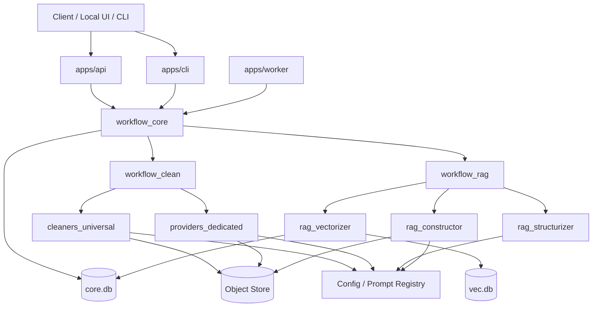

# smind-family Refactor Index

## 0. 目的与范围

本文是 `smind-family` 重构为 **Python 模块化单体** 的总索引文档。  
它用于统一定义：

1. 重构目标；
2. 技术栈选择；
3. `core.db` 与 `vec.db` 的职责边界；
4. 重构后的 monorepo 完整树状结构；
5. 组件间 communication 拓扑；
6. 逻辑模组划分与职责边界；
7. 重构执行顺序。

当前目录约定如下：

- `legacy-family/`：冻结的历史实现，保留原有 smind 家族代码，作为迁移参照；
- `docs/`：设计、评估、重构方案文档；
- `docs/action-plan/`：P0-P7 分阶段执行计划，当前已全部落盘；
- 本文：`docs/refactor/index.md`，作为后续所有重构细化文档的母索引。

---

## 1. 总体判断

`smind-family` 的重构目标不是“把 TypeScript 翻译成 Python”，而是把现有 **Cloudflare 分布式 Worker 流水线** 收敛成 **本地 Python 工作流内核**。

最终目标架构定义为：

> 一个以 Python 为主体语言、以 `core.db` 为关系型与工作流状态内核、以 `vec.db` 为本地向量索引文件、以本地对象存储为大对象载体、以 monorepo 管理模块边界的模块化单体系统。

这个目标架构必须同时满足四个约束：

1. **不再使用 queue 作为业务主通信机制；**
2. **不能退化成单线程串行脚本；**
3. **必须保留明显的分段处理与状态控制；**
4. **组件可以独立演进，但运行时不强制独立部署。**

---

## 2. 技术指征

## 2.1 主体技术路线

| 维度 | 选型 | 指征 |
| --- | --- | --- |
| 主语言 | Python 3.12+ | 优先满足 clean / rag / parsing / LLM / workflow 重构效率 |
| API 层 | FastAPI | 作为本地控制面和外部调用入口 |
| 状态内核 | SQLite `core.db` | 工作流、任务分配、审计、元数据 |
| 向量层 | SQLite `vec.db` + sqlite-vec / vec0 | 本地 embedding 索引 |
| 对象层 | Local Object Store | 替代 R2，承载 raw/cleaned/structured/export |
| 配置层 | YAML + SQLite config records | 替代 KV，支持 prompt/config 版本化 |
| 调度方式 | Scheduler + claim/lease | 替代 queue / DO / callback |
| 工程组织 | Monorepo | 保留模块边界，统一运行时 |

## 2.2 核心架构原则

1. **保留状态机，去掉部署拓扑；**
2. **保留阶段边界，去掉服务间网络调用；**
3. **保留 restart / purge / retry 语义；**
4. **保留 action registry / provider adapter；**
5. **把 Cloudflare 平台能力全部包进本地 adapter。**

## 2.3 非功能性约束

未来实现必须满足以下技术指征：

1. **所有 workflow step 必须可观测；**
2. **所有 step 必须可 claim、可重试、可重启；**
3. **所有长任务不得在持锁事务内执行；**
4. **所有跨组件异步推进必须落在 `core.db` 中；**
5. **所有向量操作必须通过 `VectorStore` 适配层完成；**
6. **所有大对象必须通过 `ObjectStore` 管理，不直接写散文件；**
7. **业务模块不能直接依赖 sqlite-vec 方言或原始 SQLite 文件路径。**

---

## 3. 重构执行顺序总览

## 3.1 先后顺序

重构建议按以下顺序执行：

1. **P0：确定基础运行目录与 monorepo 结构**
2. **P1：落 `core.db` / `vec.db` schema 与 workflow kernel**
3. **P2：迁 control plane + ingestion**
4. **P3：迁 clean workflow**
5. **P4：迁 rag workflow**
6. **P5：补 search / hydration / query 面**
7. **P6：补管理面、重启、清理、CLI 与可观测性**
8. **P7：完成 cutover、回归与 legacy freeze**

## 3.2 阶段划分

| Phase | 目标 | 产出 |
| --- | --- | --- |
| P0 | 建立代码骨架 | `apps/`、`packages/`、`data/`、`docs/refactor/` |
| P1 | 建立数据库与状态内核 | `core.db` / `vec.db` schema、migrations、workflow_core |
| P2 | 迁 ingestion 与 control plane | auth/team/files/workflow APIs |
| P3 | 迁 clean pipeline | clean dispatcher + universal/dedicated executors |
| P4 | 迁 rag pipeline | structurizer/constructor/vectorizer |
| P5 | 建检索与查询面 | search / hydration / result assembly |
| P6 | 补运维能力 | restart/purge/replay/CLI/observability |
| P7 | 收敛与替换 | cutover、回归、legacy freeze |

## 3.3 当前 action-plan 文档状态

P0-P7 的 action-plan 文档已经全部完成，当前应以这些分阶段计划作为执行层 SSOT：

| Phase | 文档 | 状态 |
| --- | --- | --- |
| P0 | `docs/action-plan/P0.md` | 已完成 |
| P1 | `docs/action-plan/P1.md` | 已完成 |
| P2 | `docs/action-plan/P2.md` | 已完成 |
| P3 | `docs/action-plan/P3.md` | 已完成 |
| P4 | `docs/action-plan/P4.md` | 已完成 |
| P5 | `docs/action-plan/P5.md` | 已完成 |
| P6 | `docs/action-plan/P6.md` | 已完成 |
| P7 | `docs/action-plan/P7.md` | 已完成 |

后续剩余工作不再是“补 planning”，而是按照 `docs/action-plan/` 逐阶段进入实现、回归、cutover 与 legacy freeze。

## 3.4 迁移原则

必须坚持：

1. **先搭骨架再迁业务；**
2. **先迁状态机再迁执行器；**
3. **先保证流程可跑通，再追求能力全覆盖；**
4. **每个阶段完成后都要形成可单独验证的闭环。**

---

## 4. `core.db` - 核心关系型数据设计

## 4.1 文件定位

建议位置：

```text
data/
  db/
    core.db
```

`core.db` 是整个系统的 **关系型主数据库 + 工作流状态内核**。  
它不是普通业务数据库，而是：

1. 关系数据中心；
2. workflow state center；
3. task scheduling center；
4. restart / retry / purge control center；
5. 审计与调试入口。

## 4.2 `core.db` 的职责边界

`core.db` 应承载：

1. 用户、团队、权限、API key；
2. ingestion source、文件、URL、API 资源；
3. workflow runs 与 workflow steps；
4. step attempts、leases、heartbeat；
5. artifact 元数据；
6. provider/config/prompt 版本信息；
7. 事件日志与审计信息。

`core.db` **不应承载**：

1. embedding 向量本体；
2. 大体积 raw 文件；
3. 大规模中间二进制对象；
4. 浏览器渲染缓存文件；
5. 向量检索核心索引。

## 4.3 推荐表分组

### A. 身份与控制面

- `users`
- `teams`
- `team_members`
- `api_keys`
- `sessions`

### B. 输入源与对象元数据

- `sources`
- `documents`
- `static_files`
- `uploads`
- `artifacts`

### C. 工作流内核

- `workflow_runs`
- `workflow_steps`
- `step_attempts`
- `task_claims`
- `workflow_step_links`
- `workflow_events`

### D. 配置与版本

- `configs`
- `prompt_versions`
- `provider_configs`

### E. 运维与调试

- `restart_requests`
- `purge_requests`
- `audit_logs`

## 4.4 `workflow_steps` 的关键字段

`workflow_steps` 至少建议包含：

| 字段 | 说明 |
| --- | --- |
| `id` | step 主键 |
| `workflow_run_id` | 所属 workflow |
| `stage` | 所属阶段，如 clean / structurize / construct / vectorize |
| `action` | 执行动作 |
| `status` | `pending/running/succeeded/failed/retry_wait/skipped/cancelled` |
| `payload_json` | 输入载荷 |
| `result_ref` | 结果引用 |
| `attempt_count` | 已尝试次数 |
| `max_attempts` | 最大尝试次数 |
| `available_at` | 下次可执行时间 |
| `priority` | 调度优先级 |
| `started_at` / `finished_at` | 执行窗口 |
| `created_at` | 创建时间 |
| `updated_at` | 更新时间 |

`claimed_by` / `lease_expires_at` 不再属于 `workflow_steps`，而是统一收敛到 `task_claims`。

## 4.5 `core.db` 的调度语义

`core.db` 通过 `workflow_steps + task_claims` 完成调度，不通过 queue。

基本流程：

1. API / workflow engine 创建新的 step；
2. worker loop 查询 `pending` 或 `retry_wait` 且到期可执行的 step；
3. 通过事务 claim；
4. 执行器在事务外运行；
5. 执行结束后写入结果、创建下游 step；
6. 若失败则写 `step_attempts` 并进入 retry 或 failed。

## 4.6 必要索引

建议最少建立：

1. `workflow_steps(stage, status, available_at)`
2. `workflow_steps(workflow_run_id, stage, status)`
3. `task_claims(step_id, status, lease_expires_at)`
4. `artifacts(workflow_run_id, artifact_type)`
5. `documents(source_id)`
6. `workflow_events(workflow_run_id, created_at)`

## 4.7 SQLite 运行参数

建议：

```sql
PRAGMA journal_mode=WAL;
PRAGMA synchronous=NORMAL;
PRAGMA foreign_keys=ON;
PRAGMA busy_timeout=5000;
PRAGMA temp_store=MEMORY;
```

同时必须遵守：

1. 长任务不持有事务；
2. 高频写尽量缩短事务长度；
3. poller 并发数可配置；
4. 重启与 purge 也必须作为显式事务处理。

---

## 5. `vec.db` - 向量数据库专用文件

## 5.1 文件定位

建议位置：

```text
data/
  db/
    vec.db
```

`vec.db` 是本地向量索引数据库，专门承载 embedding 与相似度检索能力。

## 5.2 为什么 `vec.db` 必须独立

把向量数据从 `core.db` 中独立出来，有四个明显好处：

1. **隔离写入模式**：向量 upsert/delete 的写放大与业务状态写入不同；
2. **隔离存储形态**：embedding 与关系数据的物理布局不同；
3. **隔离维护策略**：向量层更可能单独 vacuum、重建、备份；
4. **隔离未来替换成本**：未来从 sqlite-vec 切到其他本地向量引擎时影响更小。

## 5.3 `vec.db` 的职责边界

`vec.db` 应承载：

1. chunk 向量；
2. namespace / collection 维度；
3. embedding model version；
4. 向量检索所需的最小附带元信息。

`vec.db` 不应承载：

1. 用户、团队、workflow 状态；
2. 重试/租约/调度信息；
3. 大体积正文；
4. artifact 全量元数据。

## 5.4 推荐表结构

建议拆成两层：

### A. 关系辅助表

- `vector_namespaces`
  - `team_id`
  - `namespace_key`
  - `embedding_model`
  - `embedding_dimension`
  - `distance_metric`
  - `status`
  - `deleted_at`
- `vector_records`
  - `chunk_id`
  - `document_id`
  - `workflow_run_id`
  - `namespace_id`
  - `embedding_rowid`
  - `embedding_model`
  - `embedding_dimension`
  - `content_hash`
  - `deleted_at`
  - `created_at`
  - `updated_at`

### B. 向量索引表

- `chunk_embedding_index`
  - 使用 `sqlite-vec / vec0` 的向量表结构
  - `rowid` 必须与 `vector_records.embedding_rowid` 一一对应

推荐做法是：

1. `core.db` 维护 chunk / artifact / 文本引用；
2. `vec.db` 只维护向量索引与最小检索元信息；
3. search 命中后，再回 `core.db` hydrate 文本与业务上下文。

## 5.5 `core.db` 与 `vec.db` 的适配关系

两者的关系应通过逻辑主键关联，而不是物理外键：

| 逻辑键 | 含义 |
| --- | --- |
| `workflow_run_id` | 一次流程实例 |
| `document_id` | 主文档对象 |
| `chunk_id` | 向量化后的最小检索单元 |

推荐约束：

1. `chunk_id` 在整个系统中全局唯一；
2. `vec.db` 中所有向量记录都必须能在 `core.db` 找到对应 chunk 元数据；
3. 删除文档时，先写 purge request，再删除 `vec.db` 索引，再更新 `core.db` 状态。

## 5.6 为什么不能依赖跨库强事务

虽然 SQLite 支持多数据库能力，但在 `WAL` 模式下不应把 `core.db + vec.db` 设计成强依赖的跨库原子提交模型。  
因此这里的设计原则应是：

> **通过工作流状态机保证一致性，而不是依赖跨库事务保证一致性。**

也就是说：

1. 先在 `core.db` 中创建 vectorize step；
2. worker 计算 embedding；
3. 写入 `vec.db`；
4. 成功后再回写 `core.db` 标记 `vectorized`；
5. 若中途失败，则依赖 retry / purge / replay 纠正。

## 5.7 向量检索路径

推荐查询路径：

```text
query
  -> embedding adapter
  -> vec.db search top-k rowids
  -> rowid -> chunk_id 映射
  -> core.db hydrate 文本/文档/权限/上下文
  -> 返回检索结果
```

这样可以确保：

1. `vec.db` 保持轻量；
2. 权限、业务上下文、文档状态仍以 `core.db` 为准；
3. 向量层未来可替换。

---

## 6. Monorepo Tree Structure

## 6.1 当前重构期建议树结构

在迁移期，建议保留 `legacy-family/` 作为只读参照，同时在新根目录直接承载 Python 重构代码：

```text
smind-family/
  docs/
    eval/
    refactor/
      index.md
  legacy-family/
    smind-admin/
    smind-clean-dispatcher/
    smind-rag-dispatcher/
    smind-skill-clean-dedicated-apis/
    smind-skill-clean-universal/
    smind-skill-rag-constructor/
    smind-skill-rag-structurizer/
    smind-skill-rag-vectorizer/
  apps/
  packages/
  tests/
  tools/
  data/
```

## 6.2 目标树结构

推荐的完整 monorepo 结构如下：

```text
smind-family/
  docs/
    eval/
    refactor/
      index.md
      database.md
      todo-list.md
      core-db.md
      vec-db.md
      monorepo-tree.md
      communication-topology.md
      module-analysis.md
      execution-order.md
  legacy-family/
    ... frozen reference only ...
  apps/
    api/
      pyproject.toml
      src/
        main.py
        routers/
        deps/
    worker/
      pyproject.toml
      src/
        main.py
        loops/
        runners/
    cli/
      pyproject.toml
      src/
        main.py
        commands/
  packages/
    common/
      src/common/
        logging.py
        time.py
        ids.py
        errors.py
    contracts/
      src/contracts/
        commands.py
        events.py
        results.py
        workflow.py
    config/
      src/config/
        loader.py
        prompts/
        settings.py
    storage_sqlite/
      src/storage_sqlite/
        engine.py
        migrations/
        repositories/
        models/
    storage_objects/
      src/storage_objects/
        filesystem_store.py
        serializers.py
    vector_sqlite_vec/
      src/vector_sqlite_vec/
        engine.py
        schema.py
        store.py
    workflow_core/
      src/workflow_core/
        scheduler.py
        claim.py
        leases.py
        retry.py
        restart.py
        purge.py
        graph.py
    workflow_clean/
      src/workflow_clean/
        planner.py
        finalizer.py
        steps.py
        registry.py
    workflow_rag/
      src/workflow_rag/
        planner.py
        finalizer.py
        steps.py
        registry.py
    auth/
      src/auth/
        service.py
        repository.py
    team/
      src/team/
        service.py
    ingestion/
      src/ingestion/
        files.py
        urls.py
        apis.py
        workflow_start.py
    management/
      src/management/
        files.py
        workflows.py
        operations.py
    cleaners_universal/
      src/cleaners_universal/
        html_crawl.py
        browser_fetch.py
        browser_pdf.py
        llm_clean.py
        registry.py
    providers_dedicated/
      src/providers_dedicated/
        registry.py
        provider_*.py
    rag_structurizer/
      src/rag_structurizer/
        service.py
        prompts.py
    rag_constructor/
      src/rag_constructor/
        chunker.py
        summarizer.py
        recorder.py
    rag_vectorizer/
      src/rag_vectorizer/
        embedder.py
        upserter.py
        search.py
    llm_adapters/
      src/llm_adapters/
        openai.py
        gemini.py
        local_model.py
    browser_runtime/
      src/browser_runtime/
        playwright_runner.py
        extractors.py
  tests/
    unit/
    integration/
    e2e/
  tools/
    scripts/
    fixtures/
    dev/
  data/
    db/
      core.db
      vec.db
    objects/
      raw/
      cleaned/
      structured/
      constructed/
      exports/
    logs/
    tmp/
```

## 6.3 结构原则

1. `apps/` 只承载运行入口；
2. `packages/` 才是业务和基础设施核心；
3. `data/` 与代码分离；
4. `legacy-family/` 在迁移完成前保持只读；
5. `docs/refactor/` 承载所有重构设计子文档。

---

## 7. Communication 拓扑结构

## 7.1 通信原则

重构后，通信必须分成两类：

### 同步通信

用于：

1. API 调 service；
2. workflow 调 planner / finalizer；
3. worker 调 cleaner / provider / structurizer / constructor / vectorizer；
4. 所有模块调 storage / llm / browser adapters。

同步通信形式：**进程内函数调用**。

### 异步通信

用于：

1. 阶段任务领取；
2. 长任务完成后的状态推进；
3. retry / restart / purge；
4. vectorize 与索引更新。

异步通信形式：**`core.db` 驱动的状态推进**。

## 7.2 新拓扑总图



## 7.3 核心通信路径

### A. Ingestion 启动路径

```text
Client
  -> apps/api
  -> ingestion service
  -> create source/document/workflow_run/steps in core.db
  -> worker loop later claims clean step
```

### B. Clean 路径

```text
worker loop
  -> claim clean step from core.db
  -> workflow_clean planner
  -> cleaners_universal / providers_dedicated
  -> persist artifacts to object store + metadata to core.db
  -> workflow_clean finalizer
  -> create rag steps
```

### C. RAG 路径

```text
worker loop
  -> claim rag step from core.db
  -> structurizer / constructor / vectorizer
  -> object store / vec.db / core.db
  -> workflow_rag finalizer
  -> complete workflow or schedule next step
```

### D. Search 路径

```text
query
  -> embed query
  -> search vec.db
  -> hydrate results from core.db
  -> assemble response
```

## 7.4 旧拓扑与新拓扑的关键差异

| 旧拓扑 | 新拓扑 |
| --- | --- |
| service binding | 进程内调用 |
| queue intake | DB claim |
| callback HTTP | DB state transition |
| Durable Object | claim/lease + stage rules |
| D1 + R2 + Vectorize + KV | core.db + object store + vec.db + config registry |

---

## 8. 逻辑模组分析

## 8.1 控制面模组

### 对应包

- `apps/api`
- `packages/auth`
- `packages/team`
- `packages/ingestion`
- `packages/management`

### 职责

1. 用户、团队、API key；
2. 文件/URL/API ingestion；
3. workflow 启动；
4. 文件与资源管理；
5. 运行态查询、restart、purge 入口。

### 旧代码映射

主要对应 `legacy-family/smind-admin/`。

## 8.2 工作流内核模组

### 对应包

- `packages/workflow_core`
- `packages/contracts`
- `packages/storage_sqlite`

### 职责

1. workflow 图与 step 定义；
2. claim / lease / retry / replay；
3. restart / purge；
4. event 记录与可观测性；
5. scheduler 与 runner 基础能力。

### 判断

这是整个重构的核心模组，优先级最高。

## 8.3 Clean 业务模组

### 对应包

- `packages/workflow_clean`
- `packages/cleaners_universal`
- `packages/providers_dedicated`
- `packages/browser_runtime`

### 职责

1. 针对 file/url/api 三类源启动 clean 流程；
2. 依据 action registry 选择执行器；
3. 产出 cleaned text / metadata / child artifacts；
4. 把 clean 产物交给 rag workflow。

### 旧代码映射

- `legacy-family/smind-clean-dispatcher/`
- `legacy-family/smind-skill-clean-universal/`
- `legacy-family/smind-skill-clean-dedicated-apis/`

## 8.4 RAG 业务模组

### 对应包

- `packages/workflow_rag`
- `packages/rag_structurizer`
- `packages/rag_constructor`
- `packages/rag_vectorizer`
- `packages/vector_sqlite_vec`

### 职责

1. 文本结构化；
2. chunk / summary / layer-json 构造；
3. embedding 生成；
4. 本地向量 upsert / delete / search；
5. rag 阶段 finalizer 与 purge。

### 旧代码映射

- `legacy-family/smind-rag-dispatcher/`
- `legacy-family/smind-skill-rag-structurizer/`
- `legacy-family/smind-skill-rag-constructor/`
- `legacy-family/smind-skill-rag-vectorizer/`

## 8.5 基础设施模组

### 对应包

- `packages/storage_objects`
- `packages/storage_sqlite`
- `packages/vector_sqlite_vec`
- `packages/llm_adapters`
- `packages/config`
- `packages/common`

### 职责

1. SQLite 与 migrations；
2. 本地文件对象存储；
3. sqlite-vec 向量操作；
4. LLM / embedding provider 抽象；
5. prompt / config 加载与版本控制；
6. 公共日志、时间、错误、ID 体系。

### 判断

这些模组必须先稳定接口，业务层才能安全迁移。

---

## 9. 推荐的细化文档拆分

为了避免 `index.md` 继续膨胀，建议后续拆出以下子文档：

1. `docs/refactor/core-db.md`
2. `docs/refactor/vec-db.md`
3. `docs/refactor/monorepo-tree.md`
4. `docs/refactor/communication-topology.md`
5. `docs/refactor/module-analysis.md`
6. `docs/refactor/execution-order.md`
7. `docs/refactor/todo-list.md`

`index.md` 负责：

1. 总纲；
2. 术语与原则；
3. 子文档导航；
4. 执行顺序总览。

---

## 10. 重构实施顺序（详细版）

## 10.1 P0 - 建立基础骨架

先完成：

1. 建立 `apps/`、`packages/`、`tests/`、`tools/`、`data/`；
2. 建立 Python workspace；
3. 建立基础 lint/test/dev 脚本；
4. 明确 `legacy-family/` 只读约束。

## 10.2 P1 - 建立 `core.db`

先落：

1. migrations；
2. `workflow_runs`、`workflow_steps`、`task_claims`；
3. `users`、`teams`、`sources`、`documents`、`artifacts`；
4. scheduler claim/lease 基础能力。

P1 验收标准：

1. 可以从 API 创建 workflow；
2. worker 可以 claim 一个 step；
3. step 可以 succeed/fail/retry；
4. workflow 状态可查询。

## 10.3 P2 - 建立 `vec.db`

再落：

1. sqlite-vec 集成；
2. `VectorStore`；
3. embedding adapter；
4. 基础 search；
5. purge path。

P2 验收标准：

1. chunk 可写入 `vec.db`；
2. query 可返回 chunk_ids；
3. 命中结果可从 `core.db` hydrate；
4. 删除文档可同步清理向量。

## 10.4 P3 - 迁 control plane

迁：

1. auth/team/user；
2. file/url/api ingestion；
3. workflow list/detail/update；
4. management 基础查询。

## 10.5 P4 - 迁 clean pipeline

迁：

1. clean workflow planner；
2. universal cleaner；
3. dedicated provider cleaner；
4. clean finalizer。

P4 验收标准：

1. source 可进入 clean；
2. clean artifact 可产出；
3. 子文件与中间产物可记录；
4. rag step 可被创建。

## 10.6 P5 - 迁 rag pipeline

迁：

1. structurizer；
2. constructor；
3. vectorizer；
4. rag finalizer。

P5 验收标准：

1. clean artifact 可进入 rag；
2. chunk / summary 可生成；
3. embedding 可写入 `vec.db`；
4. workflow 可完整结束。

## 10.7 P6 - 迁运维能力

补：

1. restart step/workflow；
2. purge；
3. audit/events；
4. CLI；
5. 诊断与 debug 命令。

---

## 11. 最终 verdict

这次重构的正确方向不是“重新造一个本地版微服务系统”，而是：

> **把 legacy-family 的分布式编排经验，压缩成 Python 模块化单体中的显式阶段状态机。**

其中：

1. `core.db` 是状态与调度内核；
2. `vec.db` 是向量检索专用索引层；
3. monorepo 是模块独立演进的载体；
4. communication 改为“进程内调用 + DB 状态推进”；
5. 逻辑模组的迁移顺序必须以 `workflow_core` 为先。

后续所有具体设计，都应以本文定义的边界和顺序为准。
