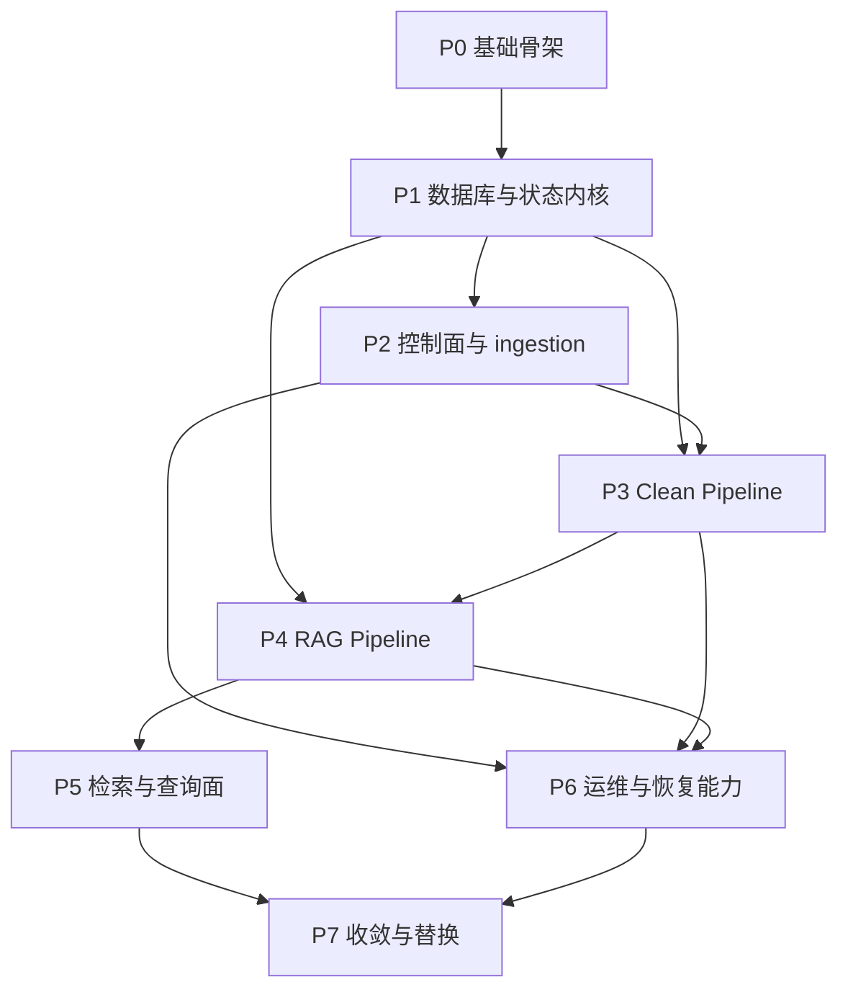

# smind-family Refactor Todo List

## 0. 文档定位

本文是 `smind-family` 重构执行层面的 **阶段化 todo-list**。  
它不是泛泛而谈的建议，而是用于指导实际重构推进的分阶段计划。

本文与其他文档的关系如下：

| 文档 | 作用 |
| --- | --- |
| `docs/refactor/index.md` | 总纲、边界、技术路线、模块映射 |
| `docs/refactor/database.md` | `core.db` / `vec.db` 设计规范 |
| `docs/refactor/core.sql` | `core.db` DDL SSOT |
| `docs/refactor/vec.sql` | `vec.db` DDL SSOT |
| `docs/refactor/todo-list.md` | 重构执行阶段、任务拆分、依赖与验收标准 |
| `docs/action-plan/P0.md` ~ `P7.md` | 分阶段执行计划与落地顺序 | 

---

## 1. 总体执行原则

本次重构必须遵守以下原则：

1. **先搭内核，再迁业务**
2. **先保证 workflow state machine 正确，再接执行器**
3. **先打通最小闭环，再补充全量能力**
4. **先做可恢复性，再做高级体验**
5. **任何阶段完成都必须可独立验收**

重构的目标不是“尽快把所有 TS 文件改写成 Python”，而是：

> **先构建一个稳定的 Python workflow kernel，然后把 legacy-family 的 clean / rag / vector 能力逐步迁入这个内核。**

当前 P0-P7 的 action-plan 文档已经全部完成；  
本文件继续承担“阶段总 checklist / 总依赖图”的职责，而每个 phase 的实施细节、里程碑与风险收敛都以下面的 `docs/action-plan/Px.md` 为准。

---

## 2. 阶段总览

| Phase | 名称 | 目标 | 主要产出 |
| --- | --- | --- | --- |
| P0 | 重构基础骨架 | 建立 monorepo、运行目录、工程约定 | `apps/`、`packages/`、`tests/`、`tools/`、`data/` |
| P1 | 数据库与状态内核 | 落 `core.db` / `vec.db` 与 workflow kernel | migrations、repositories、scheduler 基础 |
| P2 | 控制面与 ingestion | 建立北向 API 与 source/document/workflow 启动链路 | auth/team/ingestion/workflow APIs |
| P3 | Clean Pipeline | 建立 clean planner + universal/dedicated executors | clean 闭环 |
| P4 | RAG Pipeline | 建立 structurizer/constructor/vectorizer 闭环 | rag 闭环 |
| P5 | 检索与查询面 | 建立 search / hydration / result assembly | query/search API |
| P6 | 运维与恢复能力 | 建立 restart/purge/replay/heartbeat/debug | CLI、ops API、observability |
| P7 | 收敛与替换 | 从 legacy-family 切换到新实现 | cutover、回归、冻结 legacy |

## 2.1 Action-plan 文档状态

| Phase | 执行计划文档 | 状态 | 含义 |
| --- | --- | --- | --- |
| P0 | `docs/action-plan/P0.md` | 已完成 | 基础骨架实施计划已冻结 |
| P1 | `docs/action-plan/P1.md` | 已完成 | 数据库与状态内核实施计划已冻结 |
| P2 | `docs/action-plan/P2.md` | 已完成 | 控制面与 ingestion 实施计划已冻结 |
| P3 | `docs/action-plan/P3.md` | 已完成 | clean pipeline 实施计划已冻结 |
| P4 | `docs/action-plan/P4.md` | 已完成 | rag pipeline 实施计划已冻结 |
| P5 | `docs/action-plan/P5.md` | 已完成 | retrieval / hydration / query 实施计划已冻结 |
| P6 | `docs/action-plan/P6.md` | 已完成 | ops / recovery / observability 实施计划已冻结 |
| P7 | `docs/action-plan/P7.md` | 已完成 | parity / regression / cutover / legacy freeze 实施计划已冻结 |

这意味着当前的剩余工作重点已经从“补 action-plan”转成“按 action-plan 实现、回归并完成 cutover”。

---

## 3. 执行顺序判断

建议采用下面的严格顺序：

```text
P0 -> P1 -> P2 -> P3 -> P4 -> P5 -> P6 -> P7
```

原因如下：

1. **P0** 决定代码组织，不先定骨架，后续会反复返工；
2. **P1** 决定整个系统的状态机与数据库，不先定内核，业务迁移会漂移；
3. **P2** 是所有业务入口的前提；
4. **P3 / P4** 是核心业务闭环；
5. **P5** 必须建立在向量与 chunk 能力已稳定之上；
6. **P6** 是可长期运行的必要条件；
7. **P7** 才是最终切换阶段，而不是开发初期目标。

---

## 4. 横向工作流拆分

为了避免所有任务都只按目录分配，重构过程建议同时按 6 条横向工作流推进：

| 工作流 | 范围 | 说明 |
| --- | --- | --- |
| A. Platform | repo、tooling、packaging、dev scripts | 提供基础工程能力 |
| B. Data | `core.db`、`vec.db`、migrations、repositories | 提供状态与数据基础 |
| C. Workflow Kernel | claim/lease/scheduler/retry/restart/purge | 提供系统内核运行逻辑 |
| D. Control Plane | auth/team/ingestion/management/API | 提供入口与管理面 |
| E. Processing | clean/rag/vector/search | 提供业务处理能力 |
| F. Operations | observability/CLI/debug/health | 提供可维护性与恢复能力 |

每个阶段都应说明这 6 条工作流分别推进到什么程度。

---

## 5. P0 - 重构基础骨架

## 5.1 阶段目标

建立未来 Python 模块化单体的代码骨架、开发约定、目录结构与最小运行入口。

## 5.2 本阶段必须完成的事项

### A. Repo 结构

1. 建立 `apps/`
2. 建立 `packages/`
3. 建立 `tests/`
4. 建立 `tools/`
5. 建立 `data/`
6. 保留 `legacy-family/` 为只读参考

### B. Python Workspace

1. 统一 Python 版本
2. 统一包管理方式
3. 建立 monorepo workspace 约定
4. 建立包间依赖规则

### C. 基础运行入口

1. `apps/api`
2. `apps/worker`
3. `apps/cli`

### D. 基础公共包

1. `packages/common`
2. `packages/contracts`
3. `packages/config`

## 5.3 本阶段产出

1. monorepo 目录树
2. Python workspace 配置
3. 基础 lint/test/dev 脚本
4. API/worker/CLI 空壳入口
5. 公共 contracts 与 error/logging/time/id 基础模块

## 5.4 验收标准

1. 仓库可安装依赖
2. API 入口可启动
3. worker 入口可启动
4. CLI 入口可运行 help
5. 所有新代码都已位于明确模块边界下

## 5.5 风险

如果 P0 做得过于随意，后面会出现：

1. 包边界混乱
2. import 方向失控
3. storage / workflow / execution 层互相直接耦合

因此 P0 不是“搭个空目录”，而是**定义整个 monorepo 的长期边界**。

---

## 6. P1 - 数据库与状态内核

## 6.1 阶段目标

把 `core.db` 与 `vec.db` 落成真正可运行的基础设施，并建立 workflow kernel。

## 6.2 本阶段必须完成的事项

### A. `core.db`

1. 创建 migrations 体系
2. 创建 `users`, `teams`, `team_members`, `api_keys`, `sessions`
3. 创建 `uploads`, `sources`, `documents`, `static_files`, `artifacts`, `chunks`
4. 创建 `workflow_runs`, `workflow_steps`, `task_claims`, `step_attempts`, `workflow_step_links`, `workflow_events`
5. 创建 `restart_requests`, `purge_requests`, `audit_logs`
6. 创建索引与 views

### B. `vec.db`

1. 创建 `vector_namespaces`
2. 创建 `vector_records`
3. 创建 `chunk_embedding_index`
4. 建立向量 views

### C. Repository 层

1. `WorkflowRepository`
2. `StepRepository`
3. `ArtifactRepository`
4. `ChunkRepository`
5. `RestartRequestRepository`
6. `PurgeRequestRepository`
7. `VectorStore`

### D. Workflow Kernel

1. claim step
2. lease renew
3. heartbeat
4. release / finish claim
5. retry_wait 逻辑
6. expired claim reaper
7. workflow event writer

## 6.3 本阶段产出

1. `core.db` / `vec.db` migrations
2. repository 接口与 SQLite 实现
3. scheduler 最小实现
4. step claim / complete / fail / retry 能力

## 6.4 验收标准

1. 可以创建 workflow run
2. 可以创建 step
3. worker 可以 claim step
4. worker 可以 heartbeat
5. step 可以 success / fail / retry
6. claim 过期后可以重新领取
7. purge/restart request 可以持久化

## 6.5 阶段判断

P1 是整个重构里最重要的一阶段。  
如果 P1 没有把 workflow kernel 做扎实，后续 clean / rag 的迁移都会变成“业务逻辑硬编码 + 调度不可靠”的脆弱系统。

---

## 7. P2 - 控制面与 ingestion

## 7.1 阶段目标

建立本地 Python 北向控制面，把外部输入稳定转换成 `source/document/workflow_run/steps`。

## 7.2 本阶段必须完成的事项

### A. Auth / Team

1. 注册 / 登录
2. session / API key 校验
3. team 创建 / 列表 / 选择
4. user profile / update

### B. Ingestion

1. file initiate / confirm
2. URL submit
3. API submit
4. source 记录创建
5. document 记录创建
6. 启动 workflow_run

### C. Object Store

1. 本地对象存储目录初始化
2. 上传文件 object key 规则
3. JSON / text / binary serializer
4. object metadata 写回 artifact

### D. Management

1. workflow list / detail
2. document list / detail
3. static file list / detail

## 7.3 本阶段产出

1. FastAPI 北向接口初版
2. ingestion 业务服务
3. object store adapter
4. workflow start command handler

## 7.4 验收标准

1. file/url/api 三类 source 都能被创建
2. 确认上传后能生成 workflow_run
3. workflow_run 至少能创建第一批 clean steps
4. 前端或 CLI 可以查询 workflow 状态

## 7.5 依赖关系

P2 完全依赖 P1。  
没有数据库和 workflow kernel，control plane 只有表面 API，没有真正的执行基础。

---

## 8. P3 - Clean Pipeline

## 8.1 阶段目标

迁移 clean dispatcher 与两个 clean skill 体系，把所有输入源转成稳定 clean artifacts。

## 8.2 本阶段必须完成的事项

### A. `workflow_clean`

1. clean planner
2. action routing
3. clean finalizer
4. fan-out / child artifact 规则
5. 创建后续 rag steps 的逻辑

### B. `cleaners_universal`

1. `html_crawl`
2. `browser_fetch`
3. `browser_pdf`
4. `llm_clean`
5. `gemini_understanding` 或等价能力
6. action registry

### C. `providers_dedicated`

1. provider registry
2. provider adapter 抽象
3. 最先迁 1-2 个核心 provider
4. 统一产出 clean result

### D. Browser / Fetch Runtime

1. Playwright runner
2. HTML extractor
3. PDF extractor
4. retry / timeout 策略

## 8.3 本阶段产出

1. clean planner + finalizer
2. universal cleaner 初版
3. dedicated provider cleaner 初版
4. clean artifact 落地路径
5. rag step 自动创建逻辑

## 8.4 验收标准

1. file/url/api 三类输入至少各有一条 clean 闭环成功
2. 能产出 `cleaned_text` artifact
3. 能记录 child files / derived artifacts
4. clean 完成后能创建 rag steps

## 8.5 阶段判断

P3 的重点不是“把所有 cleaner 一次性全搬完”，而是：

1. 先稳定 clean planner/finalizer
2. 先跑通 20% 最核心 actions
3. 保证 clean artifacts 结构稳定

---

## 9. P4 - RAG Pipeline

## 9.1 阶段目标

迁移 rag dispatcher、structurizer、constructor、vectorizer，形成完整知识加工闭环。

## 9.2 本阶段必须完成的事项

### A. `workflow_rag`

1. rag planner
2. rag finalizer
3. step dependency control
4. purge-aware status handling

### B. `rag_structurizer`

1. structured extraction
2. schema normalization
3. prompt binding
4. result artifact 写回

### C. `rag_constructor`

1. chunker
2. summarizer
3. layer-json / constructed artifact
4. chunk records 写入 `core.db`

### D. `rag_vectorizer`

1. embedding adapter
2. `VectorStore.upsert_chunks`
3. `VectorStore.delete_chunks`
4. vectorize step result 写回
5. `chunks.vec_status` 状态推进

## 9.3 本阶段产出

1. rag planner/finalizer
2. structurizer 模块
3. constructor 模块
4. vectorizer 模块
5. `vec.db` 真正被业务写入

## 9.4 验收标准

1. clean artifact 能进入 structurizer
2. constructor 能创建 chunk 与 summary
3. vectorizer 能把 chunk upsert 到 `vec.db`
4. `chunks.vec_status` 能从 `pending_vectorize` 进入 `vectorized`
5. 整个 workflow_run 能进入 `completed`

## 9.5 风险

P4 风险最高，因为它同时涉及：

1. 大模型调用
2. chunk identity
3. vec.db 一致性
4. purge/retry/replay

因此 P4 必须以 **幂等性和状态推进正确性** 为第一优先级。

---

## 10. P5 - 检索与查询面

## 10.1 阶段目标

在向量写入稳定后，建立真正的 query/search 能力。

## 10.2 本阶段必须完成的事项

1. query embedding
2. `vec.db` top-k search
3. `core.db` hydration
4. 文档状态过滤
5. team / permission 过滤
6. search result assembly
7. debug 检索视图

## 10.3 本阶段产出

1. `VectorStore.search`
2. search service
3. search API / CLI
4. 检索日志与命中调试能力

## 10.4 验收标准

1. query 能返回 chunk hits
2. 能从 `core.db` hydrate 出完整上下文
3. purged / deleted chunk 不会被返回
4. 跨 team 数据不会串出

## 10.5 阶段判断

P5 必须在 P4 稳定后进行。  
如果 vectorize 本身状态不稳定，先做 query 只会把脏状态暴露出来。

---

## 11. P6 - 运维与恢复能力

## 11.1 阶段目标

建立让系统可长期运行、可恢复、可调试的能力。

## 11.2 本阶段必须完成的事项

### A. Restart / Replay

1. workflow restart
2. step restart
3. downstream restart
4. recovery / force recovery / kickstart 模式

### B. Purge

1. document purge
2. workflow purge
3. chunk purge
4. vector + object 双清理

### C. Observability

1. workflow summary
2. active claims
3. stale claims
4. failed steps
5. pending purge
6. pending restart

### D. CLI

1. workflow list
2. workflow inspect
3. workflow restart
4. workflow purge
5. step inspect
6. step retry

### E. Health

1. lease reaper
2. heartbeat monitor
3. pending_purge detector
4. vec/core mismatch detector

## 11.3 本阶段产出

1. ops API
2. ops CLI
3. health jobs
4. debug / audit views 的使用闭环

## 11.4 验收标准

1. 失败 workflow 可重启
2. vector purge 可重试
3. stale claim 可被接管
4. CLI 可完成日常调试操作
5. 关键异常状态可以被检测到

## 11.5 阶段判断

P6 不是“锦上添花”，而是系统进入长期运行前的必要阶段。  
没有 P6，这个系统只能算“能跑 demo”，不能算“可维护产品”。

---

## 12. P7 - 收敛与替换

## 12.1 阶段目标

让新 Python 实现成为默认实现，并把 legacy-family 从“运行依赖”退化成“历史参考”。

## 12.2 本阶段必须完成的事项

1. 补齐缺失 provider / cleaner / rag actions
2. 做端到端回归
3. 对照 legacy-family 校验产出结构
4. 切换默认入口到新 `apps/api` / `apps/worker`
5. 冻结 legacy 运行路径
6. 明确 cutover 文档

对应执行计划已落在 `docs/action-plan/P7.md`。  
当前这里保留的是总 checklist，具体 phase 拆解、里程碑、依赖与 legacy anchor 以 action-plan 为准。

## 12.3 本阶段产出

1. 新实现成为主路径
2. legacy-family 成为只读参考
3. 重构总结与剩余债务列表

## 12.4 验收标准

1. 主要业务链路全部走新实现
2. 关键管理命令全部走新实现
3. legacy-family 不再承担生产职责

---

## 13. 每阶段的最小闭环定义

为了避免阶段过大，每个阶段都必须至少产出一个“最小闭环”：

| Phase | 最小闭环 |
| --- | --- |
| P0 | API/worker/CLI 空壳可启动 |
| P1 | step claim -> execute mock -> success/fail/retry |
| P2 | file/url/api -> source/document/workflow_run |
| P3 | source -> clean artifact -> rag steps |
| P4 | clean artifact -> chunk/vector -> workflow completed |
| P5 | query -> vec hits -> hydrated results |
| P6 | restart/purge/inspect/debug 可操作 |
| P7 | 新实现成为默认主路径 |

---

## 14. 推荐的详细执行清单

下面给出建议的细粒度执行顺序。

## 14.1 第一批

1. 建 `apps/` / `packages/` 骨架
2. 建 workspace
3. 建 `common/contracts/config`
4. 落 `core.sql` / `vec.sql` migration runner
5. 落 storage/repositories

## 14.2 第二批

1. 落 workflow scheduler
2. 落 claim/lease/heartbeat/reaper
3. 落 workflow events / summaries
4. 建 API/worker/CLI 基础 wiring

## 14.3 第三批

1. 落 ingestion
2. 落 object store
3. 落 workflow start
4. 落 management read APIs

## 14.4 第四批

1. 落 clean planner/finalizer
2. 落 universal cleaner
3. 落 dedicated provider adapter
4. 跑通 clean 闭环

## 14.5 第五批

1. 落 structurizer
2. 落 constructor
3. 落 chunk persistence
4. 落 vectorizer + vec.db
5. 跑通 rag 闭环

## 14.6 第六批

1. 落 search
2. 落 restart/purge
3. 落 CLI ops
4. 落 observability

## 14.7 第七批

1. 补齐遗留 actions
2. 端到端回归
3. cutover
4. 冻结 legacy

---

## 15. 推荐的模块负责边界

为了避免多人/多阶段推进时边界混乱，建议明确如下责任：

| 模块 | 负责内容 | 不负责内容 |
| --- | --- | --- |
| `workflow_core` | claim、lease、retry、restart、purge、event | 具体 clean/rag 业务 |
| `workflow_clean` | clean planner/finalizer/step expansion | 浏览器运行底层实现 |
| `workflow_rag` | rag planner/finalizer/step expansion | embedding provider 底层实现 |
| `storage_sqlite` | core.db repositories | 向量 search 逻辑 |
| `vector_sqlite_vec` | vec.db + VectorStore | workflow state |
| `storage_objects` | object refs / read / write / delete | workflow orchestration |
| `cleaners_universal` | 通用 clean 执行 | step 调度 |
| `providers_dedicated` | provider-specific clean 执行 | 全局 workflow 状态 |
| `rag_structurizer` | 结构化提取 | chunk/vector 存储 |
| `rag_constructor` | chunk/summary 构造 | workflow scheduling |
| `rag_vectorizer` | embedding/upsert/delete/search | auth/team |

---

## 16. 阶段依赖关系



这里要特别注意：

1. **P3 不能脱离 P2**
2. **P5 不能早于 P4**
3. **P6 虽然排在后面，但底层接口在 P1 就要预留**

---

## 17. 最终建议

本次重构最容易失败的原因，不是技术选型错，而是推进方式错。  
最危险的错误推进方式包括：

1. 一开始就全面搬代码，不先建内核；
2. 先做 query，不先做 workflow consistency；
3. 把 restart/purge 放到最后才想；
4. 不分阶段验收，导致系统“哪都写了但没有闭环”。

因此推荐的最终执行策略是：

> **严格按 P0-P7 推进，每一阶段都必须交付一个最小闭环，并且只有在前一阶段状态稳定后才进入下一阶段。**

如果严格按本文推进，`smind-family` 的 Python 模块化单体重构就会有一个清晰、稳定、可执行的落地路径。
